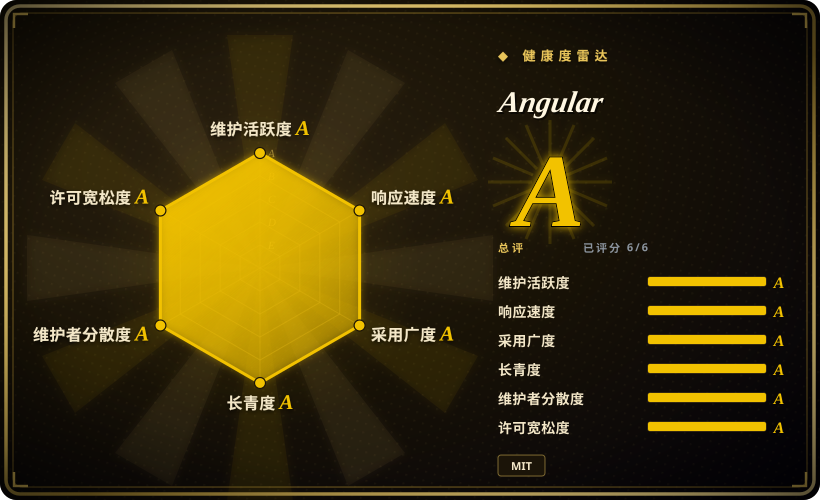

# Angular

用于构建移动端和桌面端 Web 应用的综合性开发平台。基于 TypeScript，由 Google 构建和维护，专注于企业级应用。

## 何时使用

你是一支企业团队，正在构建一个大型、复杂的 Web 应用，包含数十个页面、严格的编码规范，并对长期可维护性有要求。你评估过 React，但它「自带一切」的哲学意味着你需要花数周时间选择和拼接路由、状态管理和表单验证库。你评估过 Vue，但它更温和的学习曲线对大型团队而言内置结构不足。你选择 Angular，因为它自带你所需的一切：功能强大的 CLI 脚手架、响应式表单系统、HTTP 客户端、支持懒加载的路由器以及一流的 TypeScript 体验。你不想花数周时间评估和拼接第三方库来解决路由、状态管理或表单验证。Angular 的 opinionated 结构意味着新员工能更快上手，因为代码库遵循可预测的模式；而 Google 的长期背书让你有信心该框架在五年后仍会被维护。

## 何时不用

- **如果你需要落地页、博客或不足 10 个屏幕的简单 CRUD，请用 Vite + React 或 Vue，而不是 Angular，因为** Angular 的样板代码和构建复杂度对小型项目是大材小用。更轻的栈能让你更快交付。
- **如果你的团队回避 TypeScript，请用纯 React 或 Vue，而不是 Angular，因为** Angular 深度原生依赖 TypeScript。如果你的团队偏好纯 JavaScript，或觉得 TS 装饰器和复杂类型是负担，摩擦将持续存在。
- **如果你需要快速原型验证或快速 MVP，请用 Next.js 或 Vue，而不是 Angular，因为** Angular 严格的模块系统、构建流程和样板代码会拖慢快速迭代。更轻的框架更适合黑客马拉松和原型。
- **如果你需要 SEO 优先的静态站点，请用 Next.js 或 Nuxt，而不是 Angular，因为** 虽然 Angular 支持 SSR（Angular Universal），但在静态站点生成方面不如 Next.js 或 Nuxt 无缝。如果你的内容以静态为主且对 SEO 至关重要，那些框架是更好的选择。
- **如果你需要异构微前端，请用基于 React 的微前端配合模块联邦，而不是 Angular，因为** Angular 的 zone.js 和 Ivy 编译器在与非 Angular 微前端混合时会产生集成摩擦。如果你的架构需要混合框架的 shell，复杂度是真实存在的。
- **如果包体积对低带宽或移动优先市场至关重要，请用 Svelte 或 Preact，而不是 Angular，因为** Angular 核心框架比 React 或 Vue 更大。面向低带宽或移动优先的新兴市场的应用，初始加载体积可能是个问题。

## 横向对比

| 替代品 | 是否收录 | 我们的评价 | 取舍 |
| --- | --- | --- | --- |
| React | 未收录 | 最流行的 UI 库，生态庞大，秉承「就是 JavaScript」的理念。 | React 更灵活，就业市场更大；Angular 更 opinionated，自带更多内置工具，减少决策疲劳。 |
| Vue.js | 未收录 | 渐进式框架，学习曲线更温和，文档优秀。 | Vue 更容易增量采纳；Angular 要求全面投入，但回报是企业级更强的结构性。 |
| Svelte / SvelteKit | 未收录 | 编译时框架，运行时开销极小，没有虚拟 DOM。 | Svelte 对中小型应用更快更简单；Angular 拥有更深的企业支持、更多第三方集成和更长的记录。 |
| Next.js | 未收录 | 全栈 React 框架，SSR/SSG 一流，与 Vercel 深度集成。 | Next.js 是 React 生态 SSR/SEO 的默认选择；Angular Universal 存在，但在该细分领域不占主导。 |
| [shadcn/ui](shadcn-ui.zh.md) | ✅ | 组件分发模式，不是框架——通常在 React 内部使用。 | 并非直接替代品；shadcn/ui 关注组件所有权，Angular 是完整应用框架。 |

## 技术栈

- **TypeScript** —— 主要语言；Angular 是最早全面拥抱 TS 的框架之一
- **RxJS** —— 异步操作和状态管理的响应式编程库
- **Zone.js** —— 变更检测机制（正逐步被 Signals 取代）
- **Angular CLI** —— 基于 Webpack / esbuild 的构建、测试和脚手架工具链
- **Angular Universal** —— 服务端渲染（SSR）和静态站点生成（SSG）
- **Angular Material** —— 官方 Material Design 组件库
- **Ivy** —— 新一代编译和渲染管线
- **Signals** —— 现代细粒度响应式系统（v16+ 引入，逐步取代 zone.js）

## 依赖

- **Node.js** —— CLI 和构建工具的 Runtime（建议 LTS）
- **TypeScript** —— 框架围绕 TS 设计；使用纯 JS 不现实
- **现代浏览器** —— Angular 支持 evergreen 浏览器；已放弃 IE11 支持
- **可选：Angular Universal** —— 如需 SSR，需 Node.js 服务器
- **可选：Angular Material** —— 如需预置 Material Design 组件（非必需）
- **可选：NgRx / Akita / NGXS** —— 复杂状态管理，超出 RxJS 服务的能力
- **构建工具**：CLI 封装了 Webpack / esbuild / Vite，但高级场景可能需要自定义 builder

## 运维难度

**低到中**。Angular 应用是静态 SPA（或 SSR 应用），可部署到任何 CDN 或 Web 服务器。CLI 处理构建管线、Tree-shaking 和优化。复杂度来自：
- 需要自定义 Webpack 配置（如微前端或遗留模块联邦）
- 启用 SSR 后必须运行 Node.js 服务器
- 管理包含多个 Angular 应用的 monorepo（常用 Nx 解决）
- 升级主版本（Angular 6 个月一个主版本周期，意味着每年需升级）

## 健康度与可持续性

- **维护**：非常活跃——由 Google 维护，6 个月一个主版本周期，有公开路线图。最近两个主版本提供长期支持（LTS）。
- **治理**：Google 所有。Angular 团队历史上不受 Google 内部重组影响，但仍是单厂商项目。社区通过 Angular Community Discord 和 GitHub 有发言权。
- **背书**：Google 是主要背书方。Angular 在 Google 内部被使用（Google Cloud Console、Firebase Console 等），这提供了持续维护的强激励。
- **采用度**：企业采用度强，100.4k stars，2014 年创建（12 年记录）。是大型企业和金融科技代码库的中流砥柱。就业市场健康，尤其在企业咨询领域。
- **风险旗标**：MIT 许可宽松。Google 维护 Angular 的记录良好，但「Google 会砍掉项目」的风险始终是背景噪音。未见 relicense 历史。从 zone.js 到 Signals 的架构转变是重大变化；现有应用可能需要迁移。

## 存疑（未验证）

- [推断] Angular 从 zone.js 到 Signals 的迁移时间线，以及 Google 内部使用 Angular 的应用比例，未经核实。
- [未验证] 企业级生产部署的确切数量及其规模未经独立审计。
- [未验证] Angular 相对于 React 和 Vue 在新项目启动中的市场份额，是从职位发布和社区调查推断的，而非硬数据。
- [推断] 与非 Angular shell 的微前端集成是可行的，但具体摩擦程度取决于模块联邦配置。
- [推断] Angular 包体积相对于 React 或 Vue 的实际性能影响因应用和优化策略而异。
