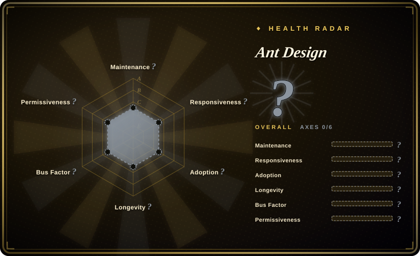

# Ant Design

An enterprise-class UI design language and React UI library. One of the most widely adopted component libraries for building admin dashboards, data-dense applications, and enterprise tools in the React ecosystem.

## When to use

You're building a data-dense admin dashboard, an internal operations tool, or a B2B SaaS application in React. You look at shadcn/ui, but you don't want to copy-paste and maintain every component file yourself — you need a library you can install via npm and import. You look at Material UI, but you need more enterprise-grade data components out of the box: sortable tables with built-in filters, date range pickers, tree controls, and upload widgets that handle large file lists. You choose Ant Design because it gives you a comprehensive set of pre-built, accessible components that look professional without hiring a designer. You install it via npm, import the components, and your app looks consistent and polished immediately. The design system is battle-tested by Alibaba and thousands of other companies, so you know it scales to complex, multi-role enterprise interfaces.

## When NOT to use

- **If you use Vue, use Ant Design Vue or Element Plus instead of Ant Design, because** Ant Design is a React library. There is no official Vue port of the core library, and the React components cannot be used in Vue projects.
- **If your brand requires a highly custom visual identity that deviates from Material Design, use shadcn/ui or Tailwind UI instead of Ant Design, because** Ant Design's visual language is distinctive (the "Ant Design look"). Overriding the default styles can be tedious and fragile.
- **If bundle size is critical and you need a lightweight library, use shadcn/ui or Radix UI instead of Ant Design, because** the full Ant Design library is large. Even with tree-shaking, the design tokens and CSS add significant weight.
- **If you need a mobile-first consumer app, use Ionic or Flutter instead of Ant Design, because** while Ant Design Mobile exists, the primary library is desktop-focused. For consumer mobile apps, native or hybrid frameworks are the better choice.
- **If you want headless, unstyled primitives with full styling control, use Radix UI or Headless UI instead of Ant Design, because** Ant Design is a fully styled component library. If you want to build your own design system from unstyled primitives, Ant Design is the wrong abstraction level.
- **If your stack forbids Less or CSS-in-JS, use shadcn/ui or MUI instead of Ant Design, because** Ant Design uses Less for theming and requires specific build tooling for deep customization. If you want CSS-module-level isolation or a Tailwind-native workflow, friction will occur.

## Comparison

| Alternative | In index | Our verdict | Tradeoff |
| --- | --- | --- | --- |
| Material UI (MUI) | 未收录 | The most popular React UI library with a Material Design aesthetic and a large enterprise presence. | MUI is more ubiquitous in the West; Ant Design dominates in China and Asia-Pacific enterprise. Both are comprehensive; choose based on design language preference and regional ecosystem. |
| [shadcn/ui](shadcn-ui.md) | ✅ | Copy-paste React components you own, built on Radix UI and Tailwind CSS. | shadcn/ui gives you full ownership and no npm dependency; Ant Design gives you a faster start but deeper lock-in and less styling flexibility. |
| Chakra UI | 未收录 | Modular React component library with a focus on developer experience and accessibility. | Chakra UI is more "developer-friendly" for custom theming; Ant Design has more enterprise-grade components (especially data tables and forms). |
| Radix UI | 未收录 | Headless, unstyled primitives for building your own design system. | Radix is lower-level (you bring your own styles); Ant Design is a complete, styled system. |
| Bootstrap / React-Bootstrap | 未收录 | Classic CSS framework with React wrappers. | Bootstrap is older and simpler; Ant Design is more modern, component-rich, and better suited for complex data-driven apps. |

## Tech stack

- **TypeScript** — primary language; all components are typed
- **React** — the target UI framework (Ant Design is a React library)
- **Less** — CSS pre-processor for theming and component styles
- **CSS-in-JS** — used internally for dynamic styling (via `@ant-design/cssinjs`)
- **Design Tokens** — centralized token system for colors, spacing, typography
- **Ant Design Mobile** — separate React Native / mobile component library (not the same package)
- **dumi** — documentation site generator used for ant.design

## Dependencies

- **React** — required peer dependency (v16.8+ for hooks, v18+ recommended)
- **ReactDOM** — required peer dependency
- **TypeScript** — optional but strongly recommended for type safety
- **Build toolchain** — Webpack, Vite, or esbuild for bundling and Less compilation
- **Optional: moment.js / dayjs / date-fns** — Ant Design's date components require a date library (dayjs is recommended as the lighter alternative)
- **Optional: @ant-design/icons** — the official icon library (separate package)
- **Optional: ant-design/charts or AntV** — for data visualization (separate ecosystem)

## Ops difficulty

**Low**. Ant Design is an npm library, not a standalone service. Operational concerns are limited to:
- Keeping the library updated (major version upgrades can involve breaking changes in component APIs and theming)
- Managing bundle size by importing only the components you use
- Customizing the theme via Less variables or the ConfigProvider component
- Ensuring your build pipeline handles Less compilation or that you use the pre-built CSS
- Monitoring for accessibility issues in complex components (tables, forms) that may need manual ARIA adjustments

## Health & viability
- **Maintenance**: Grade A — 13/13 active weeks in trailing 13; last commit 1 day ago.
- **Responsiveness**: Grade A — median first-response time 0.1 hours across 40 qualifying issues/PRs.
- **Adoption**: Cannot be scored — registry_no_counts.
- **Longevity**: Grade A — 4088 days old.
- **Governance**: Grade A — top-3 contributor share 52.0% (?).
- **Risk / License**: Grade A — MIT license.

## Caveats (unverified)

- [未验证] The exact proportion of Ant Design's user base in China versus the rest of the world has not been verified.
- [推断] Ant Design's CSS-in-JS approach (via `@ant-design/cssinjs`) may have performance implications in very large applications with many dynamic style updates.
- [未验证] The accessibility audit results for all Ant Design components have not been independently verified.
- [推断] The level of influence Alibaba's internal product roadmap has on Ant Design's open-source priorities is not transparently documented.
- [推断] The actual performance impact of Ant Design's bundle size and CSS-in-JS overhead compared to lighter libraries like shadcn/ui depends on the specific component set and usage patterns.
