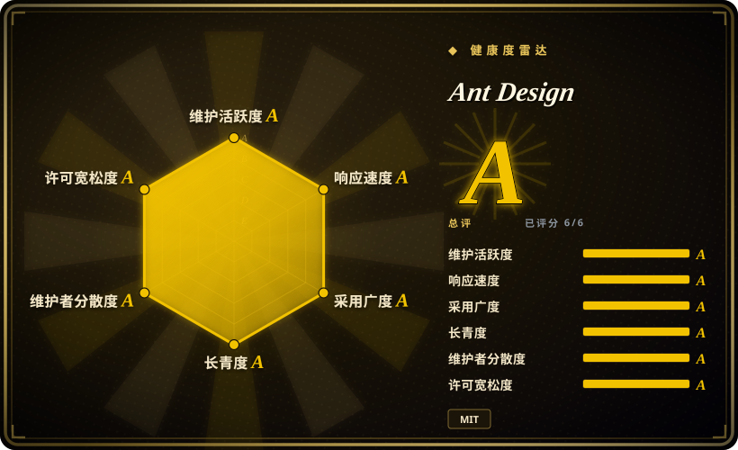

# Ant Design

企业级 UI 设计语言和 React UI 库。在 React 生态中，它是构建管理后台、数据密集型应用和企业工具时最广泛采用的组件库之一。

## 何时使用

你正在用 React 构建一个数据密集的管理后台、内部运营工具或 B2B SaaS 应用。你看过 shadcn/ui，但不想自己复制粘贴并维护每个组件文件——你需要一个能通过 npm 安装并直接导入的库。你看过 Material UI，但你需要更多开箱即用的企业级数据组件：带内置筛选的排序表格、日期范围选择器、树形控件和处理大文件列表的上传组件。你选择 Ant Design，因为它给你一整套开箱即用、无障碍的预置组件，看起来专业，无需雇佣设计师。通过 npm 安装、导入组件，你的应用立刻变得一致且精致。这套设计系统经过阿里巴巴和数千家公司的实战检验，你知道它能支撑复杂的多角色企业界面。

## 何时不用

- **如果你使用 Vue，请用 Ant Design Vue 或 Element Plus，而不是 Ant Design，因为** Ant Design 是 React 库。核心库没有官方 Vue 移植版本，React 组件无法在 Vue 项目中使用。
- **如果你的品牌需要显著偏离 Material Design 的定制视觉标识，请用 shadcn/ui 或 Tailwind UI，而不是 Ant Design，因为** Ant Design 的视觉语言很有辨识度（「Ant Design 风格」）。覆盖默认样式可能繁琐且脆弱。
- **如果包体积至关重要且你需要轻量库，请用 shadcn/ui 或 Radix UI，而不是 Ant Design，因为** 完整的 Ant Design 库体积较大。即使使用 Tree-shaking，设计令牌和 CSS 也会增加相当重量。
- **如果你需要移动优先的 consumer 应用，请用 Ionic 或 Flutter，而不是 Ant Design，因为** 虽然有 Ant Design Mobile，但主库面向桌面。consumer 移动应用更适合原生或混合框架。
- **如果你想要无样式的 headless 原语并完全掌控样式，请用 Radix UI 或 Headless UI，而不是 Ant Design，因为** Ant Design 是完整的带样式组件库。如果你想从无样式原语构建自己的设计系统，Ant Design 的抽象层级不对。
- **如果你的技术栈禁止 Less 或 CSS-in-JS，请用 shadcn/ui 或 MUI，而不是 Ant Design，因为** Ant Design 使用 Less 做主题化，需要特定构建工具才能深度定制。如果你需要 CSS Module 级隔离或 Tailwind 原生工作流，会产生摩擦。

## 横向对比

| 替代品 | 是否收录 | 我们的评价 | 取舍 |
| --- | --- | --- | --- |
| Material UI（MUI） | 未收录 | 最受欢迎的 React UI 库，Material Design 风格，企业用户众多。 | MUI 在西方更普遍；Ant Design 在企业和亚太市场占主导。两者都很全面；按设计语言偏好和区域生态选择。 |
| [shadcn/ui](shadcn-ui.zh.md) | ✅ | 复制粘贴即可拥有的 React 组件，基于 Radix UI 和 Tailwind CSS。 | shadcn/ui 让你完全拥有、无 npm 依赖；Ant Design 启动更快，但锁定更深、样式灵活性更低。 |
| Chakra UI | 未收录 | 模块化 React 组件库，注重开发者体验和无障碍。 | Chakra UI 的自定义主题更「开发者友好」；Ant Design 拥有更多企业级组件（尤其是数据表格和表单）。 |
| Radix UI | 未收录 | 无样式的 headless 原语，用于构建自己的设计系统。 | Radix 层级更低（样式自理）；Ant Design 是完整的带样式系统。 |
| Bootstrap / React-Bootstrap | 未收录 | 经典 CSS 框架加 React 包装。 | Bootstrap 更老更简单；Ant Design 更现代、组件更丰富，更适合复杂数据驱动应用。 |

## 技术栈

- **TypeScript** —— 主要语言；所有组件均带类型
- **React** —— 目标 UI 框架（Ant Design 是 React 库）
- **Less** —— 用于主题化和组件样式的 CSS 预处理器
- **CSS-in-JS** —— 内部用于动态样式（通过 `@ant-design/cssinjs`）
- **Design Tokens** —— 颜色、间距、字体的集中式令牌系统
- **Ant Design Mobile** —— 独立的 React Native / 移动端组件库（非同包）
- **dumi** —— ant.design 文档站点生成器

## 依赖

- **React** —— 必需的对等依赖（v16.8+ 支持 hooks，建议 v18+）
- **ReactDOM** —— 必需的对等依赖
- **TypeScript** —— 可选但强烈建议，用于类型安全
- **构建工具链** —— Webpack、Vite 或 esbuild，用于打包和 Less 编译
- **可选：moment.js / dayjs / date-fns** —— Ant Design 的日期组件需要日期库（推荐 dayjs 作为更轻量的替代方案）
- **可选：@ant-design/icons** —— 官方图标库（独立包）
- **可选：ant-design/charts 或 AntV** —— 数据可视化（独立生态）

## 运维难度

**低**。Ant Design 是 npm 库，不是独立服务。运维关注点仅限于：
- 保持库更新（主版本升级可能涉及组件 API 和主题化的破坏性变更）
- 通过仅导入所需组件来管理包体积
- 通过 Less 变量或 ConfigProvider 组件自定义主题
- 确保构建流程能处理 Less 编译，或使用预构建 CSS
- 监控复杂组件（表格、表单）的无障碍问题，可能需要手动调整 ARIA

## 健康度与可持续性

- **维护**：非常活跃——截至 2026-07 仍有日常推送，发布节奏规律，issue/PR 吞吐量大（98.5k stars，1,284 个 open issue）。
- **治理**：由阿里巴巴开源生态内的 Ant Design Team 维护。项目拥有多名核心提交者，治理模型清晰。Bus factor 中等到良好。
- **背书**：阿里巴巴背书，中国最大科技公司之一。这提供了稳定性和资源，但也意味着项目方向受阿里巴巴内部需求影响。
- **采用度**：亚太企业市场采用度极强，全球范围持续增长。98.5k stars，2015 年创建（11 年记录）。阿里巴巴、腾讯和数千家创业公司都在使用。
- **风险旗标**：MIT 许可宽松。未见 relicense 历史。项目与阿里巴巴的紧密关系意味着某些西方企业可能产生地缘政治或合规顾虑。v4 到 v5 的迁移涉及主题化破坏性变更；未来主版本可能同样需要投入。

## 存疑（未验证）

- [未验证] Ant Design 用户在中国与全球其他地区的精确比例未经核实。
- [推断] Ant Design 的 CSS-in-JS 方案（通过 `@ant-design/cssinjs`）在包含大量动态样式更新的超大型应用中可能存在性能影响。
- [未验证] 所有 Ant Design 组件的无障碍审计结果未经独立验证。
- [推断] 阿里巴巴内部产品路线图对 Ant Design 开源优先级的具体影响程度未公开记录。
- [推断] Ant Design 的包体积和 CSS-in-JS 开销相对于 shadcn/ui 等轻量库的实际性能影响，取决于具体组件集和使用模式。
