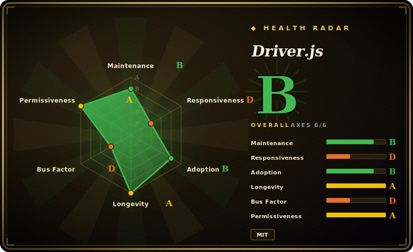

# Driver.js

A lightweight, dependency-free JavaScript/TypeScript library that draws an overlay and spotlight to guide user focus across a web page — product tours, feature highlights, and step-by-step onboarding, with no framework and no runtime deps.

## When to use

You're a frontend engineer on a SaaS dashboard, and product wants a "first-run" walkthrough: when a new user lands, highlight the sidebar nav, then the "Create project" button, then the settings gear — each with a popover explaining what it does, a Next button, and a dimmed backdrop so the rest of the UI fades out of focus. You don't want to pull in a heavy onboarding SDK or a React-only tour kit, and the app is plain Vue with a sprinkle of vanilla JS in places. You reach for Driver.js: you `npm install driver.js`, import `driver`, hand it an array of steps (`{ element: '#sidebar', popover: { title, description } }`), call `.drive()`, and it renders the overlay, the spotlight cutout around each element, the popover, and the prev/next/close controls — no framework binding required, ~5KB-ish gzipped, zero dependencies.

You also reach for it for one-off "feature spotlight" moments — you shipped a new button and want to draw attention to it once — or for highlighting a single element programmatically (`driver().highlight({ element, popover })`) without a multi-step tour. Because it's pure DOM and framework-agnostic, it drops into React, Vue, Svelte, Angular, or no-framework pages alike, and the styling is themeable via CSS so you can match your design system.

## When NOT to use

- **You need a full onboarding/adoption *platform*, not just tours.** Driver.js draws tours; it has no segmentation, no analytics, no A/B targeting, no "show this tour to users who haven't done X" logic, no checklists, no NPS surveys. If you need that, you want Appcues / Userflow / Userpilot (commercial) — or you'll build the state/feature-flag layer yourself (e.g. Shepherd.js + your own "has this user seen the tour?" persistence). Driver.js is the *rendering* layer only.
- **Heavily dynamic / async DOM in an SPA.** Steps anchor to elements by selector. If the element doesn't exist yet (route not mounted, data still loading, virtualized list, modal animating in), the highlight targets nothing or jumps. You'll be writing timing/`MutationObserver` glue to wait for elements, re-position on scroll/resize, and handle steps whose targets unmount mid-tour. [推断]
- **Strict accessibility / keyboard / screen-reader requirements.** Overlay-and-spotlight tours are a known a11y minefield (focus trapping, `aria-*` on injected popovers, keyboard navigation, reduced-motion). Verify the current version's a11y behavior against your WCAG bar rather than assuming it's handled. [未验证]
- **You wanted a UI component kit.** It is not buttons/menus/modals/forms — it only does the tour/highlight overlay. Pair it with your actual component library.
- **You need deep tour branching / conditional flows out of the box.** Complex multi-path tours (branch on user action, skip steps, resume later) are doable but you orchestrate them in your own code; the library gives you steps + an imperative API, not a flow engine.

## Comparison

| Alternative | In index | Our verdict | Tradeoff |
|---|---|---|---|
| Shepherd.js | 未收录 | Use this page for its stated niche; choose Shepherd.js when you need similar OSS tour library, more built-in step/positioning options and a richer API. | Similar OSS tour library, more built-in step/positioning options and a richer API; heavier (uses Floating UI / popper-style positioning) and a larger bundle than Driver.js's dependency-free core. |
| Intro.js | 未收录 | Use this page for its stated niche; choose Intro.js when you need the original tour library. | The original tour library; widely used but its modern usage is **dual-licensed** (free for non-commercial, paid commercial license) — a real lock-in/cost consideration Driver.js (MIT) avoids (license terms in Caveats). |
| Reactour / react-joyride | 未收录 | Use this page for its stated niche; choose Reactour / react-joyride when you need react-specific tour components (hooks/JSX-native). | React-specific tour components (hooks/JSX-native); nicer DX inside React, but framework-locked vs Driver.js's framework-agnostic vanilla core. |
| Appcues / Userflow / Userpilot | 未收录 | Use this page for its stated niche; choose Appcues / Userflow / Userpilot when you need commercial no-code onboarding **platforms**. | Commercial no-code onboarding **platforms** — segmentation, analytics, targeting, checklists, surveys; not open-source repos, recurring SaaS cost, but solve product-led-growth, not just tour rendering. |

## Tech stack

- **Language:** TypeScript, compiled to a small JS bundle (ESM + UMD builds published to npm).
- **Rendering:** pure DOM + CSS — it injects an SVG/overlay for the dimmed backdrop and spotlight cutout, positions a popover relative to the highlighted element, and exposes an imperative `driver()` API (`drive()`, `highlight()`, `moveNext()`, `destroy()`, lifecycle hooks).
- **Dependencies:** none at runtime — that's the headline; positioning and overlay math are done in-library rather than via a popper/Floating-UI dependency.
- **Theming:** styled via CSS variables / class overrides so it can match a host design system.

## Dependencies

- **Runtime:** none. A `<script>` tag (CDN/UMD) or an `npm install driver.js` import; it runs entirely client-side in the browser, no backend, no services.
- **Build (for app authors):** a bundler that resolves the npm package (Vite/webpack/esbuild/Rollup) and imports both the JS and its CSS; usable framework-free or inside any framework.
- **Browser:** modern evergreen browsers; exact minimum/legacy support and any polyfill needs are version-dependent — verify against the target browser matrix. [未验证]

## Ops difficulty

**Low.** This is a client-side library, not a service — there is nothing to deploy or operate. "Ops" here is just: add the dependency, ship the JS+CSS in your bundle, and you're done; no server, no datastore, no scaling concern. The real cost is **integration/maintenance** in your own app: defining the steps, keeping selectors in sync as the UI changes (a tour silently breaks when you rename a class or restructure the DOM), handling SPA timing, and theming. None of that is operational burden — it's frontend code you own and test.

## Health & viability

- **Maintenance (2026-06).** Pushed 2026-06-27; latest release v1.6.0 on 2026-06-25, with 1.5.0/1.4.0 earlier in 2026 — **active and shipping**, not coasting. Not archived. [推断]
- **Governance / bus factor.** The repo owner is a **`User` account, not an organization** — `nilbuild`, which is the renamed personal account of the original author Kamran Ahmed (`kamranahmedse`). One contributor holds ~521 commits while the next contributors sit at ~3 each ⇒ effectively a **single-maintainer project — a real bus-factor flag**. MIT-licensed and dependency-free, so a fork is cheap if maintenance ever lapses, but the roadmap follows one person. [推断]
- **Age & Lindy verdict.** Created 2018-03 (~8 years old) and **still actively released** ⇒ a **solid Lindy** signal — a long-proven, widely-adopted tour library rather than a hyped newcomer. Use age × still-active: the bus-factor flag is the offsetting risk, not the age. [推断]
- **Adoption & lock-in.** ~26k stars and broad real-world use across the JS ecosystem; MIT + zero runtime dependencies = **low lock-in** (no proprietary license, no SDK, easy to rip out or fork). Contrast Intro.js's commercial-licensing wrinkle. [未验证]
- **Risk flags.** Single-maintainer/personal-repo bus factor is the main one; no relicense history or open-core gating found (it is plain MIT). [推断]

## Caveats (unverified)

- [未验证] ~26.0k GitHub stars, ~1.18k forks as of 2026-06 — star/fork counts are date-sensitive and unreliable as a health proxy; treat as indicative only.
- [未验证] Bundle size ("~5KB gzipped") is the project's own framing and varies by version/build (ESM vs UMD, with/without CSS) — measure against your actual build rather than quoting a fixed number.
- [推断] Owner `nilbuild` (User id 4921183) is the renamed personal account of `kamranahmedse`; "single-maintainer" is inferred from the contributor distribution (~521 vs ~3), not from a stated governance doc.
- [未验证] SPA timing/dynamic-DOM friction and the current a11y/keyboard/screen-reader behavior are inferred from how overlay-tour libraries generally work — verify against the version you pin for your specific app and WCAG bar.
- [未验证] Intro.js's "dual/commercial license" is a general recollection of its licensing model — confirm Intro.js's current license terms directly before relying on that distinction.
