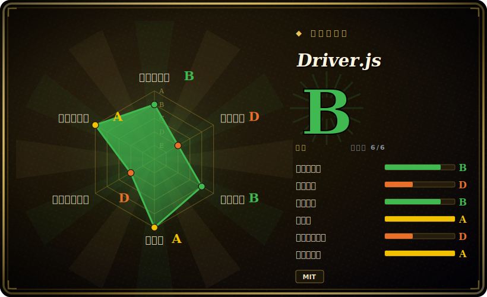

# Driver.js

一个轻量、零依赖的 JavaScript/TypeScript 库，靠遮罩加聚光（spotlight）引导用户在页面上的视觉焦点——产品引导（product tour）、新功能高亮、分步 onboarding，无需任何框架、无运行时依赖。

## 何时使用

你是某 SaaS 后台的前端工程师，产品想要一个“首次进入”的引导：新用户一进来，先高亮侧边导航，再高亮“新建项目”按钮，然后是设置齿轮——每一步配一个气泡（popover）说明它是干嘛的、一个 Next 按钮，还有一层压暗的背景把其余 UI 淡出焦点。你不想为此引入一个笨重的 onboarding SDK，也不想用一个只能在 React 里跑的 tour 套件，而且这个应用是纯 Vue，局部还夹着一点原生 JS。于是你选了 Driver.js：`npm install driver.js`，导入 `driver`，给它一个步骤数组（`{ element: '#sidebar', popover: { title, description } }`），调一下 `.drive()`，它就渲染出遮罩、每个元素周围的聚光镂空、气泡，以及上一步/下一步/关闭控件——不绑定任何框架，gzip 后约 5KB 量级，零依赖。

你也会在“单点功能高亮”的场景里选它——刚上线一个新按钮、想一次性地把注意力引过去——或者不做多步引导，只用 `driver().highlight({ element, popover })` 以编程方式高亮单个元素。因为它是纯 DOM、框架无关，所以同样能落进 React、Vue、Svelte、Angular 或无框架页面，样式还能通过 CSS 主题化以贴合你的设计系统。

## 何时不用

- **你需要的是完整的 onboarding/采用*平台*，而不只是引导。** Driver.js 只画引导；它没有人群分层、没有埋点分析、没有 A/B 定向、没有“只对没做过 X 的用户展示此引导”的逻辑，也没有 checklist、没有 NPS 问卷。要这些，你要的是 Appcues / Userflow / Userpilot（商业产品）——或者自己搭那层状态/feature-flag（比如 Shepherd.js 加上你自己实现的“这个用户看过引导没？”持久化）。Driver.js 只是*渲染*层。
- **SPA 里高度动态 / 异步的 DOM。** 步骤靠选择器锚定元素。如果元素还不存在（路由没挂载、数据还在加载、虚拟列表、模态框正在动画进入），高亮就会指向空或者乱跳。你得自己写定时 / `MutationObserver` 胶水去等元素、在滚动/缩放时重新定位，还要处理引导途中目标被卸载的步骤。[推断]
- **严格的无障碍 / 键盘 / 读屏要求。** 遮罩加聚光式引导是公认的 a11y 雷区（焦点陷阱、注入气泡上的 `aria-*`、键盘导航、reduced-motion）。请对照你的 WCAG 标准核实当前版本的无障碍行为，别假设它已经处理好了。[未验证]
- **你想要的是一套 UI 组件库。** 它不是按钮/菜单/模态框/表单——它只做引导/高亮遮罩。把它和你真正的组件库搭配使用。
- **你需要开箱即用的深度引导分支 / 条件流程。** 复杂的多路径引导（按用户操作分支、跳步、稍后续接）能做，但要靠你自己的代码编排；这个库给的是步骤加一套命令式 API，而不是一个流程引擎。

## 横向对比

| 替代品 | 是否收录 | 我们的评价 | 取舍 |
|---|---|---|---|
| Shepherd.js | 未收录 | 当前页用于它的主场景；如果更看重“类似的开源引导库，内置的步骤/定位选项更多、API 更丰富”，再选 Shepherd.js。 | 类似的开源引导库，内置的步骤/定位选项更多、API 更丰富；但更重（用 Floating UI / popper 风格定位），bundle 比 Driver.js 零依赖的内核大。 |
| Intro.js | 未收录 | 当前页用于它的主场景；如果更看重“最早的引导库”，再选 Intro.js。 | 最早的引导库；用得很广，但其现代用法是**双协议授权**（非商用免费、商用需付费）——这是个实打实的锁定/成本考量，而 Driver.js（MIT）没有（授权条款见存疑）。 |
| Reactour / react-joyride | 未收录 | 当前页用于它的主场景；如果更看重“React 专属的引导组件（hooks/JSX 原生）”，再选 Reactour / react-joyride。 | React 专属的引导组件（hooks/JSX 原生）；在 React 内 DX 更好，但被框架锁定，对比 Driver.js 框架无关的原生内核。 |
| Appcues / Userflow / Userpilot | 未收录 | 当前页用于它的主场景；如果更看重“商业的无代码 onboarding **平台**”，再选 Appcues / Userflow / Userpilot。 | 商业的无代码 onboarding **平台**——分层、分析、定向、checklist、问卷；不是开源仓库，有持续的 SaaS 订阅成本，但解决的是 product-led-growth，而不只是引导渲染。 |

## 技术栈

- **语言：** TypeScript，编译成一个小体积 JS bundle（npm 上发布 ESM + UMD 两种构建）。
- **渲染：** 纯 DOM + CSS——注入一层 SVG/遮罩做压暗背景与聚光镂空，相对被高亮元素定位一个气泡，并暴露命令式 `driver()` API（`drive()`、`highlight()`、`moveNext()`、`destroy()` 以及生命周期 hook）。
- **依赖：** 运行时零依赖——这是卖点；定位与遮罩的计算在库内部完成，而不是借助 popper/Floating-UI 这类依赖。
- **主题：** 通过 CSS 变量 / class 覆盖来定制样式，以贴合宿主设计系统。

## 依赖

- **运行时：** 无。一个 `<script>` 标签（CDN/UMD）或 `npm install driver.js` 导入即可；它完全在浏览器端运行，无后端、无服务。
- **构建（应用作者侧）：** 一个能解析该 npm 包的打包器（Vite/webpack/esbuild/Rollup），同时导入它的 JS 和 CSS；可无框架使用，也可嵌入任意框架。
- **浏览器：** 现代常青浏览器；具体的最低/旧版支持以及是否需要 polyfill 取决于版本——请对照你的目标浏览器矩阵核实。[未验证]

## 运维难度

**低。** 这是个客户端库，不是服务——没有任何东西要部署或运维。这里的“运维”只是：加上依赖、把 JS+CSS 打进你的 bundle，就完事了；没有服务器、没有数据存储、没有扩容问题。真正的成本在于你自己应用里的**集成/维护**：定义步骤、在 UI 变化时让选择器保持同步（你一改类名或重构 DOM，引导就会无声地坏掉）、处理 SPA 时序、做主题。这些都不是运维负担——而是你自己拥有并要测试的前端代码。

## 健康度与可持续性

- **维护（2026-06）。** 最后 push 于 2026-06-27；最新版本 v1.6.0 发布于 2026-06-25，1.5.0/1.4.0 也在 2026 年内——**活跃且在持续发版**，并非吃老本。未归档。[推断]
- **治理 / bus factor。** 仓库 owner 是一个 **`User` 账号，而非组织**——`nilbuild`，即原作者 Kamran Ahmed（`kamranahmedse`）改名后的个人账号。一名贡献者握有约 521 次提交，而紧随其后的贡献者各自只有约 3 次⇒实质上是**单维护者项目——一个实打实的 bus-factor 风险标记**。MIT 授权且零依赖，所以一旦维护停摆，fork 的代价很低，但路线图跟随一个人。[推断]
- **年龄与 Lindy 判断。** 2018-03 创建（约 8 年）且**仍在活跃发版**⇒ 一个**扎实的 Lindy** 信号——一个久经验证、被广泛采用的引导库，而非被炒作的新秀。用年龄 × 仍活跃来看：bus-factor 标记才是对冲风险，年龄本身不是。[推断]
- **采用度与锁定。** 约 26k star，在 JS 生态里有广泛的真实使用；MIT + 运行时零依赖 = **低锁定**（无私有授权、无 SDK，易于移除或 fork）。对照 Intro.js 的商业授权问题。[未验证]
- **风险标记。** 单维护者/个人仓库的 bus factor 是主要一项；未发现 relicense 历史或 open-core 收费墙（它就是纯 MIT）。[推断]

## 存疑（未验证）

- [未验证] 截至 2026-06 约 26.0k GitHub star、约 1.18k fork——star/fork 数对时间敏感，作为健康度代理并不可靠，仅供参考。
- [未验证] bundle 体积（“约 5KB gzip”）是项目自己的说法，随版本/构建而变（ESM 还是 UMD、含不含 CSS）——请对照你实际的构建去测量，而不是引用一个固定数字。
- [推断] owner `nilbuild`（User id 4921183）是 `kamranahmedse` 改名后的个人账号；“单维护者”是从贡献者分布（约 521 对约 3）推断的，而非来自某份治理文档。
- [未验证] SPA 时序/动态 DOM 的摩擦，以及当前版本的 a11y/键盘/读屏行为，都是从遮罩式引导库的一般工作方式推断而来——请对照你为具体应用锁定的版本和 WCAG 标准核实。
- [未验证] Intro.js 的“双协议/商业授权”是对其授权模式的一般记忆——在依赖这一区别前，请直接确认 Intro.js 当前的授权条款。
