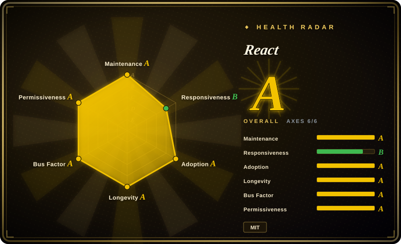

# React

A declarative, component-based JavaScript library for building user interfaces. Maintained by Meta, it is the most widely adopted UI library in the world, powering everything from single-page apps to native mobile apps via React Native.

## When to use

You're a frontend team building a modern SaaS dashboard. Your product has dozens of interactive screens, real-time data tables, complex forms, and a need for deep customization. You evaluate Angular, but its opinionated module system and boilerplate feel heavy for the pace you need. You evaluate Vue, but your team is already steeped in JavaScript and you want the deepest ecosystem and hiring pool. You choose React because its component model lets you break the UI into reusable, composable pieces, JSX makes the markup intuitive, and Hooks let you manage state and side effects without learning a new paradigm. The ecosystem means you can find a battle-tested library for almost any problem — routing, state management, charts, data grids — and when you later need server-side rendering or static site generation, Next.js sits right on top. React is not just a library; it is a career and ecosystem bet.

## When NOT to use

- **If you need a complete, batteries-included framework out of the box, use Angular or Next.js instead of React, because** React is only the view layer. You must bring your own router, state management, and build toolchain.
- **If your team is new to frontend and struggles with JavaScript closures, use Vue instead of React, because** React's Hooks have strict rules (call order, dependency arrays) and stale closure bugs are a common pitfall for beginners.
- **If you need the smallest possible bundle for a simple widget or landing page, use Svelte or Preact instead of React, because** React's virtual DOM and runtime overhead are larger than compile-time alternatives.
- **If you want a strict, predictable architecture without assembling your own stack, use Angular instead of React, because** React is unopinionated. Teams must self-organize patterns or risk spaghetti code.
- **If you need SEO-first static sites without extra configuration, use Next.js or Nuxt instead of plain React, because** React is client-side rendered by default and SSR requires a meta-framework.
- **If you want a truly reactive, signal-based system without manual memoization, use Solid.js or Svelte instead of React, because** React's re-rendering model requires explicit optimization (useMemo, useCallback, memo) to avoid performance traps.

## Comparison

| Alternative | In index | Our verdict | Tradeoff |
| --- | --- | --- | --- |
| [Vue.js](vue.md) | ✅ | Choose Vue when you need a progressive framework with a gentler learning curve and excellent documentation. | Vue is easier to adopt incrementally; React has a larger ecosystem and deeper job market. |
| [Angular](angular.md) | ✅ | A comprehensive, opinionated TypeScript framework built by Google for enterprise-scale apps. | Angular ships with everything built-in; React is more flexible but requires you to assemble your own stack. |
| [Svelte](svelte.md) | ✅ | Choose Svelte when you want compile-time components with minimal runtime and no virtual DOM. | Svelte is faster and simpler for small-to-medium apps; React has a vastly larger ecosystem and hiring pool. |
| [SvelteKit](sveltekit.md) | ✅ | Choose SvelteKit when you want Svelte's full-stack app framework rather than a UI library. | SvelteKit adds routing, SSR, and app conventions around Svelte; React alone stays lighter but requires more stack assembly. |
| [Next.js](nextjs.md) | ✅ | Choose Next.js when you need the default full-stack React framework with SSR/SSG and Vercel ecosystem depth. | Next.js is React plus routing, SSR, and deployment; use it when you need those features, use plain React when you want a lighter, more controlled setup. |
| [shadcn/ui](../component-libraries/shadcn-ui.md) | ✅ | A component distribution model built on top of React — not a substitute, but a common companion. | shadcn/ui gives you copy-and-own components inside React; it is not a standalone UI library. |
| [Ant Design](../component-libraries/ant-design.md) | ✅ | An enterprise-class React component library with a comprehensive set of pre-built components. | Ant Design is a styled component kit you use *inside* React; it is not a replacement for React itself. |
| [Driver.js](../product-tours/driver-js.md) | ✅ | A lightweight, dependency-free tour and spotlight library. | Not a UI framework substitute; use it alongside React for onboarding tours. |

## Tech stack

- **JavaScript / TypeScript** — React is written in JavaScript with first-class TypeScript definitions; you can author components in either
- **JSX** — the syntax extension that lets you write HTML-like markup inside JavaScript
- **Virtual DOM** — a lightweight in-memory representation of the real DOM that React uses to batch and optimize UI updates
- **Hooks** — the functional-component state and lifecycle primitives (useState, useEffect, useContext, etc.) that replaced class components
- **React Server Components (RSC)** — a new architecture in React 18+ that lets components render exclusively on the server, blurring the client/server boundary
- **React Native** — a separate but related framework for building native mobile apps using React components
- **Concurrent Features** — the modern rendering engine (introduced in React 18) that enables Suspense, transitions, and priority-based updates

## Dependencies

- **Node.js** — for build tooling (LTS recommended)
- **A modern browser** — React supports evergreen browsers; IE11 support was dropped in React 18
- **Build toolchain** — you need a bundler that handles JSX (Vite, Next.js, webpack, Parcel, or esbuild)
- **ReactDOM** — required peer dependency for rendering to the DOM
- **Optional: React Router / TanStack Router** — for client-side routing (React has no built-in router)
- **Optional: Redux / Zustand / Jotai / Recoil** — for state management beyond useState/useContext
- **Optional: Next.js / Remix** — for SSR, SSG, and full-stack capabilities
- **Optional: React Native** — for building native mobile apps (separate toolchain)

## Ops difficulty

**Low to Medium.** React is a client-side library; the deployment is just a static bundle. The operational burden comes from the assembly required:
- You must choose, configure, and maintain your own router, state management, and build pipeline
- You must understand and apply performance optimizations (useMemo, useCallback, React.memo, code splitting) or re-renders will degrade UX
- React Server Components (RSC) introduce a server runtime that adds deployment complexity (Node.js server, streaming, caching)
- Major version upgrades are generally backward-compatible but may require codemods (e.g., class-to-hooks migration in the past)
- The ecosystem moves fast; keeping dependencies up to date across many third-party libraries is a real maintenance tax

## Health & viability

- **Maintenance (2026-07).** React is actively developed by a large team at Meta with frequent point releases and a public RFC process. The repo shows daily activity.
- **Governance / bus factor.** Meta owns the roadmap, but React is MIT-licensed and has a broad external contributor base. The core team is large enough that no single individual is a single point of failure. The RFC process and the independent Next.js/Vercel ecosystem act as a check on Meta's exclusive control.
- **Backing & longevity.** Maintained by Meta since 2013 (~13 years old) and still the dominant frontend library. The Lindy prior is strong: a project that has been the market leader for over a decade is a safer long-term bet than any newcomer. The ecosystem is large enough that a community fork would be viable if Meta ever shifted priorities.
- **Adoption & ecosystem.** The deepest hiring pool, the most Stack Overflow answers, and the largest third-party library ecosystem of any frontend tool. React is the default choice taught in bootcamps and used in enterprise codebases. The ecosystem includes Next.js, React Native, and countless component libraries.
- **Risk flags.** No major relicense history (stayed MIT). The open-core risk is low because React itself is fully open. React Server Components are a paradigm shift that fragments the ecosystem between frameworks (Next.js, Remix, etc.), which may create long-term portability concerns.

## Caveats (unverified)

- [未验证] ~235k GitHub stars as of 2026-07; star counts are approximate and time-sensitive.
- [未验证] The exact React 19 feature set and Server Component adoption rate across the ecosystem have not been independently verified.
- [推断] Meta's long-term strategic commitment to React is strong but not contractually guaranteed; the roadmap follows Meta's internal priorities.
- [推断] The performance overhead of React's virtual DOM compared to compile-time frameworks (Svelte, Solid.js) varies by application and optimization effort.
- [推断] React's "Hooks rules" (only call at top level, only call from React functions) and stale closure issues are common beginner pitfalls, but the exact frequency of production bugs caused by them is not measured.
- [推断] The job-market dominance claim is inferred from industry surveys and job-board data, not a rigorous census.
