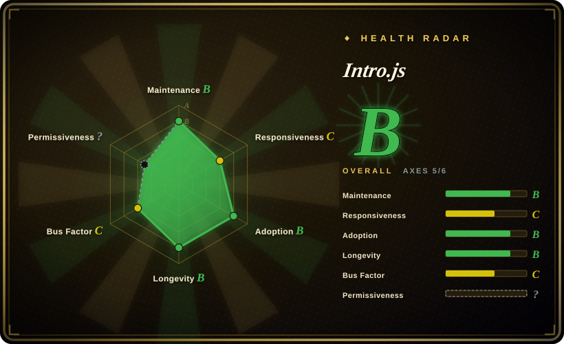

# Intro.js

A mature, framework-agnostic JavaScript library for step-by-step product tours, feature highlights, and user onboarding — one of the oldest and most widely used tour libraries, with a **dual-licensing model** (AGPL-3.0 for non-commercial use; commercial license required for business/closed-source use) that is the decisive filter for most selection decisions.

## When to use

You're a frontend developer building an open-source educational platform, and you need to guide new users through the interface: a welcome tooltip on the dashboard, a highlight around the "Create course" button, a step-by-step walkthrough of the grading workflow, each with a progress indicator and keyboard navigation. Your site is built with plain HTML and vanilla JS — no React, no Vue — and you want a tour library that drops in without framework bindings or runtime dependencies. You also want extensive documentation and examples to get started quickly. You reach for Intro.js: you add a `<script>` tag or `npm install intro.js`, annotate your DOM elements with `data-intro` and `data-step` attributes, call `introJs().start()`, and it renders the tour overlay, tooltips, and progress — no build step drama, no framework lock-in.

You also reach for it when you need auto-play tours, programmatic step control, or multi-page tour flows that persist across navigation. Because it has been actively maintained since 2013, the API is stable and the documentation is comprehensive, which matters when you're onboarding a team of contributors who need to understand and extend the tour logic.

## When NOT to use

- **You are building a commercial or closed-source product without purchasing a commercial license.** Intro.js is dual-licensed under AGPL-3.0 for non-commercial use; business use requires a paid commercial license. This is not a footnote — it is a binding legal requirement that has caused real compliance issues for companies who treated it as "free because it's on GitHub." [未验证]
- **You want a fully permissive (MIT) license without licensing friction.** Driver.js and Shepherd.js are MIT-licensed alternatives that avoid the AGPL/commercial-license bifurcation entirely. If your legal team bristles at copyleft or you don't want to track license compliance across team members, pick one of those instead.
- **Bundle size is your absolute constraint.** Intro.js is ~10KB gzipped — larger than Driver.js (~5KB) and competitive with Shepherd.js. For a single spotlight on one element, the overhead may not be worth it.
- **Heavily dynamic / async DOM in an SPA.** Steps anchor to elements by selector. If the element doesn't exist yet (route not mounted, data loading, virtualized list, modal animating in), the tour targets nothing or jumps. You'll write timing/`MutationObserver` glue to wait for elements and re-position on scroll/resize. [推断]
- **Strict accessibility / keyboard / screen-reader requirements.** Overlay-and-spotlight tours are a known a11y minefield (focus trapping, `aria-*` on injected popovers, keyboard navigation, reduced-motion). Verify the current version's a11y behavior against your WCAG bar rather than assuming it's handled. [未验证]
- **You need a full onboarding/adoption *platform*, not just tours.** Intro.js renders tours; it has no segmentation, analytics, A/B targeting, checklists, or surveys. If you need that, you want Appcues / Userflow / Userpilot (commercial) or you'll build the state layer yourself.
- **You want deep tour branching / conditional flows out of the box.** Complex multi-path tours (branch on user action, skip steps, resume later) are doable but you orchestrate them in your own code; the library gives you steps + an imperative API, not a flow engine.

## Comparison

| Alternative | In index | Our verdict | Tradeoff |
|---|---|---|---|
| [Driver.js](../web-ui/driver-js.md) | ✅ | Use this page for its stated niche; choose Driver.js when you want a MIT-licensed, lighter, zero-dependency alternative. | MIT-licensed, smaller bundle (~5KB), zero dependencies; fewer built-in features and positioning options than Intro.js. |
| Shepherd.js | 未收录 | Use this page for its stated niche; choose Shepherd.js when you want a MIT-licensed tour library with a richer API and more positioning options. | MIT-licensed, more built-in step/positioning options and a richer API; uses Floating UI / popper-style positioning, heavier than Driver.js. |
| Reactour / react-joyride | 未收录 | Use this page for its stated niche; choose Reactour / react-joyride when you need React-specific tour components (hooks/JSX-native). | React-specific components (hooks/JSX-native); nicer DX inside React but framework-locked vs Intro.js's vanilla core. |
| Appcues / Userflow / Userpilot | 未收录 | Use this page for its stated niche; choose Appcues / Userflow / Userpilot when you need a commercial no-code onboarding **platform**. | Commercial platforms with segmentation, analytics, targeting, checklists, surveys; not open-source repos, recurring SaaS cost. |
| Bootstrap Tour | 未收录 | Use this page for its stated niche; avoid Bootstrap Tour — it is abandoned and unmaintained. | Abandoned; was a Bootstrap-dependent tour plugin, no longer viable. |

## Tech stack

- **Language:** JavaScript (ES5+), compiled to a small JS bundle with ESM + UMD builds published to npm.
- **Rendering:** pure DOM + CSS — injects overlay, tooltip popovers, and spotlight highlights directly into the page, positions them relative to target elements, and exposes an imperative `introJs()` API (`start()`, `goToStep()`, `exit()`, lifecycle callbacks).
- **Dependencies:** none at runtime — a pure JavaScript library with zero framework dependencies or external libraries.
- **Theming:** styled via CSS class overrides and custom themes so it can match a host design system.

## Dependencies

- **Runtime:** none. A `<script>` tag (CDN/UMD) or `npm install intro.js` import; it runs entirely client-side in the browser, no backend, no services.
- **Build (for app authors):** a bundler that resolves the npm package (Vite/webpack/esbuild/Rollup) and imports both the JS and its CSS; usable framework-free or inside any framework (React, Vue, Angular, Svelte).
- **Browser:** modern evergreen browsers; exact minimum/legacy support is version-dependent — verify against your target browser matrix.

## Ops difficulty

**Low.** This is a client-side library, not a service — there is nothing to deploy or operate. "Ops" here is just: add the dependency, ship the JS+CSS in your bundle, and you're done; no server, no datastore, no scaling concern. The real cost is **integration/maintenance** in your own app: defining the steps, keeping selectors in sync as the UI changes (a tour silently breaks when you rename a class or restructure the DOM), handling SPA timing, and theming. None of that is operational burden — it's frontend code you own and test.

The **license** is the real operational/policy consideration: if you use Intro.js in a commercial product, you must purchase and track a commercial license, and your legal/ compliance team must be aware of the AGPL boundary. That is a recurring process cost that MIT-licensed alternatives (Driver.js, Shepherd.js) do not impose.

## Health & viability

- **Maintenance (2026-07).** Active at v7.x with regular releases; ~22k GitHub stars and a long history of community use. Not archived. [未验证]
- **Age & Lindy verdict.** Created in 2013 (~13 years old) and **still actively maintained** ⇒ a **very strong Lindy** signal — one of the longest-lived, most-proven tour libraries in the JavaScript ecosystem. Use age × still-active: this is a safe bet for continued existence, though the licensing model is the offsetting risk, not the age. [推断]
- **Governance / bus factor.** Maintained by `usablica` (the organization of original author Afshin Mehrabani). The project has outlived many of its competitors and has a broader contributor base than single-maintainer alternatives. [未验证]
- **Adoption & ecosystem.** Very widely adopted across the web; extensive documentation, many examples, and broad community familiarity. The licensing model means commercial adoption is split between licensed users and those who migrate to MIT alternatives. [推断]
- **Risk flags.** The **dual-licensing model** (AGPL-3.0 / commercial) is the primary risk flag. It has caused confusion and legal compliance issues for companies that missed the commercial-license requirement. Verify current pricing and terms before committing; confirm whether your use case falls under the non-commercial exception or requires a paid license. [未验证]

## Caveats (unverified)

- [未验证] ~22k GitHub stars as of 2026-07 — star count is date-sensitive and unreliable as a health proxy; treat as indicative only.
- [未验证] Bundle size (~10KB gzipped) is approximate and varies by version/build (ESM vs UMD, with/without CSS) — measure against your actual build.
- [未验证] Commercial license pricing cited as ~$20–50 one-time or subscription depending on plan — verify current pricing directly on the Intro.js website before budgeting.
- [未验证] The dual-licensing model and its enforcement history are based on general knowledge of the project's licensing terms; confirm the current license text and commercial terms directly before relying on this distinction.
- [推断] SPA timing/dynamic-DOM friction and a11y/keyboard/screen-reader behavior are inferred from how overlay-tour libraries generally work — verify against the version you pin for your specific app and WCAG bar.
- [推断] "Governance / bus factor" and "broader contributor base" assessments are based on GitHub visibility and project longevity, not a detailed analysis of contributor distribution or a governance document.
