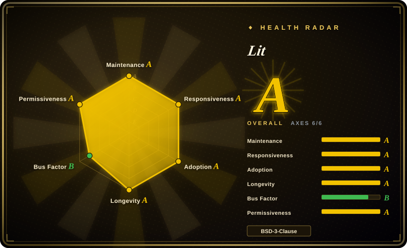

# Lit

A lightweight library from Google for building fast, interoperable web components. Built on Web Components standards with no virtual DOM and a tiny runtime (~3 KB for lit-html).

## When to use

You're a design system lead at a company whose products span multiple frontend frameworks — React for the marketing site, Vue for the admin dashboard, and Angular for a legacy internal tool. You need a shared component library (buttons, inputs, cards, dialogs) that works everywhere without forcing any team to migrate. You evaluate React-only libraries, but they lock you into React. You evaluate Vue, same problem. You choose Lit because it builds on Web Components standards — your components compile to standard custom elements that work in any HTML context, with any framework. Lit's lit-html gives you efficient, direct DOM updates without a virtual DOM, and the ~3 KB runtime keeps bundles small. Your components ship once and render correctly in the React site, the Vue dashboard, and the Angular app.

## When NOT to use

- **If your team is building a full SPA and wants a batteries-included framework with routing, state management, and CLI, use React, Vue, or Angular instead of Lit, because** Lit is a component library, not a full application framework. It has no built-in router, no global state management, and no CLI scaffolding.
- **If your team is already deep in React and has no cross-framework interoperability needs, use React or Preact directly instead of Lit, because** adding Lit introduces an extra abstraction layer and a different mental model (Shadow DOM, slots, custom elements) for no benefit.
- **If you need a rich ecosystem of third-party UI components, charts, and plugins, use React or Vue instead of Lit, because** Lit's ecosystem is smaller; there are fewer component libraries, fewer tutorials, and fewer Stack Overflow answers.
- **If your team doesn't know Web Components and won't invest time to learn them, avoid Lit, because** Lit assumes you understand Custom Elements, Shadow DOM, and slots. The learning curve is real if you're coming from React's JSX-centric model.
- **If SEO and server-side rendering are critical and you need a turnkey solution, use Next.js or Nuxt instead of Lit, because** while Lit SSR exists, it is not as mature or seamless as Next.js/Nuxt. The SSR story for Web Components is still evolving.
- **If you need reactive data binding across complex nested component trees without boilerplate, use Vue or Svelte instead of Lit, because** Lit's reactivity is explicit and property-based; deep reactive state management requires additional patterns or libraries.

## Comparison

| Alternative | In index | Our verdict | Tradeoff |
| --- | --- | --- | --- |
| [React](react.md) | ✅ | Choose React when you need the largest UI ecosystem and JSX-based application components. | React has a larger ecosystem and job market; Lit is framework-agnostic and based on standards, making it ideal for design systems that must work everywhere. |
| [Vue.js](vue.md) | ✅ | Choose Vue when you need a progressive app framework with a gentler learning curve and richer ecosystem. | Vue is easier to learn and has a richer ecosystem; Lit is smaller and more interoperable but requires Web Components knowledge. |
| [Svelte](svelte.md) | ✅ | Choose Svelte when you want compile-time app components with minimal runtime and no virtual DOM. | Svelte compiles away its framework; Lit is a runtime library that leverages browser standards. Both are small, but Svelte is a full framework. |
| [Angular](angular.md) | ✅ | Comprehensive, opinionated enterprise framework with TypeScript and DI. | Angular is a full-stack framework for large SPAs; Lit is a lightweight library for building reusable components, not full apps. |
| Stencil | 未收录 | Ionic's Web Components compiler — compiles to standards-compliant custom elements. | Stencil is a compile-time toolchain; Lit is a runtime library. Stencil is better for generating component libraries from decorated classes; Lit is simpler for direct use. |
| Native `<template>` / hand-written DOM | 未收录 | Browser-native approach with zero dependencies but no reactivity or DX. | Native DOM is verbose and error-prone; Lit gives you reactive templates and a component base class with minimal overhead. |
| Web Components (standards) | N/A | Not a library — the browser standard that Lit is built on. | You can write custom elements by hand; Lit adds efficient templating, reactivity, and developer experience on top. |

## Health & viability

- **Maintenance (2026-07).** Lit is actively maintained with the last commit 9 days ago and 6 active weeks out of the last 13. Issue median first-response time is ~8.4 hours, indicating responsive community support. Google's Chrome team continues to invest resources.
- **Governance / bus factor.** Governance health is rated B. There are 22 active contributors in the last 12 months, with the top 1 at 44.2% share and top 3 at 62.3% — a relatively balanced distribution. While Google engineers hold significant influence, community engagement is sufficient and bus-factor risk is moderate.
- **Backing & longevity.** Lit originated from and is maintained by the Google Chrome team (~9 years), BSD-3-Clause licensed. As one of the primary drivers of Web Components standards, its longevity is tied to browser standards; as long as Web Components standards persist, Lit has strategic value. Google has sunset other projects (e.g., Polymer), but Lit as a lighter successor has gained broad adoption. The Lindy effect is positive: a nearly decade-long, still-active project carries lower risk than a new framework.
- **Adoption & ecosystem.** npm package `lit` sees ~24.6M downloads per month with 16,100 dependent repos. Used extensively inside Google (Material Web Components is built on Lit) and adopted by numerous design systems and component libraries. The ecosystem is smaller than React's but Lit is the leader in the Web Components space.
- **Risk flags.** BSD-3-Clause license (permissive), no relicense history. Key risks: (1) Google's strategic priority shifts (though current investment is stable); (2) varying browser support for Web Components standards (older browsers require polyfills). Overall risk is low.

## Tech stack

- **TypeScript** — primary development language; Lit has first-class TS support
- **Web Components standards** — Custom Elements, Shadow DOM, HTML templates (the browser-native foundation)
- **lit-html** — efficient HTML template rendering with direct DOM updates (no virtual DOM)
- **LitElement** — reactive base class for creating Web Components with declarative templates
- **SSR** — server-side rendering support for Lit components (still maturing)
- **Compiler** — optional experimental compiler for ahead-of-time optimization

## Dependencies

- **A modern browser** — Lit relies on Web Components standards (Custom Elements v1, Shadow DOM v1); evergreen browsers support these natively
- **No build tool required** — Lit works with plain ES modules in the browser, but TypeScript compilation is recommended for production
- **Optional: TypeScript compiler** — for type checking and compiling `.ts` files to JS
- **Optional: bundler** (Vite, Rollup, Webpack) — for production bundling and tree-shaking, though not strictly required
- **No framework runtime dependency** — Lit components do not depend on React, Vue, or Angular

## Ops difficulty

**Low**. Lit components are standard Web Components that deploy as static JavaScript files to any CDN or web server. There is no server-side runtime, no special hosting requirement, and no framework-specific build pipeline. Complexity arises only when:
- You integrate Lit components into an existing framework app (requires understanding framework-Web Component interop patterns)
- You enable SSR, which requires a Node.js server and is still maturing
- You need to polyfill older browsers (pre-2020 browsers may lack Custom Elements / Shadow DOM support)

## Caveats (unverified)

- [未验证] The exact bundle size of lit-html in production (~3 KB) may vary by build configuration and tree-shaking.
- [未验证] The maturity and feature completeness of Lit SSR compared to Next.js/Nuxt has not been independently verified.
- [推断] Lit's ecosystem size relative to React/Vue is inferred from community activity and package download counts, not hard data.
- [推断] Google's long-term commitment to Lit is inferred from its origin in the Chrome team and continued maintenance, but Google has sunset other projects before.
