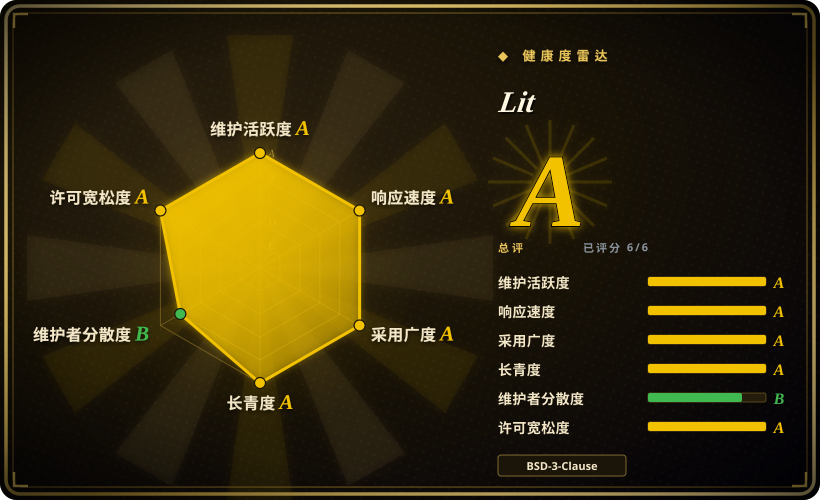

# Lit

一个由 Google 出品的轻量级库，用于构建快速、可互操作的 Web Components。基于 Web Components 标准，无虚拟 DOM，运行时体积极小（lit-html 约 3 KB）。

## 何时使用

你是一家使用多种前端框架（React、Vue、Angular）的公司的设计系统负责人，需要构建一套能在所有产品中使用的共享组件库，而不强迫各团队迁移。你评估过仅支持 React 的库，但它们把你锁死在 React 里。你评估过 Vue，同样的问题。你选择 Lit，因为它基于 Web Components 标准——你的组件编译为标准自定义元素，可在任何 HTML 环境中、与任何框架一起工作。Lit 的 lit-html 提供高效的直接 DOM 更新，无需虚拟 DOM，且约 3 KB 的运行时保持包体积极小。你的 button、input 和 card 组件现在只需发布一次，就能在 React 营销站点、Vue 管理后台和 Angular 遗留应用中同时工作。

## 何时不用

- **如果你的团队正在构建完整 SPA，想要一个带路由、状态管理和 CLI 的 batteries-included 框架，请用 React、Vue 或 Angular，而不是 Lit，因为** Lit 是一个组件库，不是完整的应用框架。它没有内置路由器、没有全局状态管理、也没有 CLI 脚手架。
- **如果你的团队已经深度使用 React，且没有跨框架互操作需求，请直接用 React 或 Preact，而不是 Lit，因为** 引入 Lit 会增加一层抽象和一种不同的心智模型（Shadow DOM、slots、custom elements），却没有任何收益。
- **如果你需要丰富的第三方 UI 组件、图表和插件生态，请用 React 或 Vue，而不是 Lit，因为** Lit 的生态较小；组件库、教程和 Stack Overflow 答案都更少。
- **如果你的团队不了解 Web Components，也不愿意投入时间学习，请避免 Lit，因为** Lit 默认你理解 Custom Elements、Shadow DOM 和 slots。如果你来自 React 的 JSX 中心模型，学习曲线是真实存在的。
- **如果 SEO 和服务端渲染至关重要，且你需要 turnkey 解决方案，请用 Next.js 或 Nuxt，而不是 Lit，因为** 虽然 Lit SSR 存在，但不如 Next.js/Nuxt 成熟和无缝。Web Components 的 SSR 方案仍在演进中。
- **如果你需要跨复杂嵌套组件树的无样板响应式数据绑定，请用 Vue 或 Svelte，而不是 Lit，因为** Lit 的响应式是显式的、基于属性的；深度响应式状态管理需要额外的模式或库。

## 横向对比

| 替代品 | 是否收录 | 我们的评价 | 取舍 |
| --- | --- | --- | --- |
| React | 未收录 | 最流行的 UI 库，生态庞大，基于 JSX 的组件模型。 | React 生态和就业市场更大；Lit 基于标准、框架无关，适合必须在各处工作的设计系统。 |
| Vue.js | 未收录 | 渐进式框架，学习曲线温和，文档优秀。 | Vue 更容易上手，生态更丰富；Lit 更小巧、更具互操作性，但需要 Web Components 知识。 |
| Svelte | 未收录 | 编译时框架，运行时极小，无虚拟 DOM。 | Svelte 将框架编译掉；Lit 是利用浏览器标准的运行时库。两者都很小，但 Svelte 是完整框架。 |
| [Angular](angular.zh.md) | ✅ | 全面的、有主见的企业级框架，带 TypeScript 和依赖注入。 | Angular 是面向大型 SPA 的全栈框架；Lit 是构建可复用组件的轻量级库，不是完整应用框架。 |
| Stencil | 未收录 | Ionic 的 Web Components 编译器——编译为标准兼容的自定义元素。 | Stencil 是编译时工具链；Lit 是运行时库。Stencil 更适合从装饰类生成组件库；Lit 更适合直接使用。 |
| 原生 `<template>` / 手写 DOM | 未收录 | 零依赖的浏览器原生方案，但无响应式和开发者体验。 | 原生 DOM 冗长且容易出错；Lit 在极小开销下提供响应式模板和组件基类。 |
| Web Components（标准） | N/A | 不是库——Lit 所基于的浏览器标准。 | 你可以手写自定义元素；Lit 在此基础上增加了高效模板、响应式能力和开发者体验。 |

## 健康度与可持续性

- **维护状态（2026-07）。** Lit 维护活跃，最近提交 9 天前，过去 13 周中有 6 周活跃。Issue 中位首次响应时间约 8.4 小时，响应迅速。Google 的 Chrome 团队继续投入资源。
- **治理与 bus factor。** 治理健康度为 B，过去 12 个月有 22 位活跃贡献者，前 1 位占比 44.2%，前 3 位占比 62.3%，分布相对均衡。虽然 Google 工程师占重要地位，但社区参与度足够，bus factor 风险适中。
- **背书与长期性。** Lit 由 Google Chrome 团队发起并维护（约 9 年历史），BSD-3-Clause 许可证。作为 Web Components 标准的主要推动者之一，其长期存在与浏览器标准绑定，只要 Web Components 标准存续，Lit 就有战略价值。Google 曾终止过其他项目（如 Polymer），但 Lit 作为更轻量的继任者，已被广泛采用。Lindy 效应正面：一个持续活跃近十年的项目，风险低于新框架。
- **采用与生态。** npm 包 `lit` 月下载量约 2460 万，16100 个依赖仓库。Google 内部大量使用（Material Web Components 基于 Lit），被众多设计系统和组件库采用。生态虽小于 React，但在 Web Components 领域是领导者。
- **风险标志。** BSD-3-Clause 许可证（宽松），无重新授权历史。风险主要在于：1）Google 的战略优先级变化（虽然当前投入稳定）；2）Web Components 标准的浏览器支持差异（旧版浏览器需要 polyfill）。整体风险较低。

## 技术栈

- **TypeScript** —— 主要开发语言；Lit 对 TS 有一流支持
- **Web Components 标准** —— Custom Elements、Shadow DOM、HTML 模板（浏览器原生基础）
- **lit-html** —— 高效的 HTML 模板渲染，直接更新 DOM（无虚拟 DOM）
- **LitElement** —— 创建带声明式模板的响应式 Web Components 的基类
- **SSR** —— Lit 组件的服务端渲染支持（仍在成熟中）
- **Compiler** —— 可选的实验性编译器，用于提前优化

## 依赖

- **现代浏览器** —— Lit 依赖 Web Components 标准（Custom Elements v1、Shadow DOM v1）；evergreen 浏览器原生支持这些特性
- **无需构建工具** —— Lit 可直接以 ES modules 在浏览器中运行，但生产环境建议使用 TypeScript 编译
- **可选：TypeScript 编译器** —— 用于类型检查和将 `.ts` 文件编译为 JS
- **可选：打包工具**（Vite、Rollup、Webpack）—— 用于生产打包和 Tree-shaking，虽非严格必需
- **无框架运行时依赖** —— Lit 组件不依赖 React、Vue 或 Angular

## 运维难度

**低**。Lit 组件是标准 Web Components，可作为静态 JavaScript 文件部署到任何 CDN 或 Web 服务器。没有服务端运行时，没有特殊托管要求，也没有框架特定的构建管线。复杂度仅在以下情况出现：
- 将 Lit 组件集成到现有框架应用中时（需要理解框架与 Web Component 的互操作模式）
- 启用 SSR 时，需要 Node.js 服务器且方案仍在成熟中
- 需要为旧版浏览器提供 polyfill（2020 年前的浏览器可能缺少 Custom Elements / Shadow DOM 支持）

## 存疑（未验证）

- [未验证] lit-html 在生产环境中的精确包体积（约 3 KB）可能因构建配置和 Tree-shaking 而异。
- [未验证] Lit SSR 相对于 Next.js/Nuxt 的成熟度和功能完整性未经独立验证。
- [推断] Lit 相对于 React/Vue 的生态规模是从社区活跃度和包下载量推断的，而非硬数据。
- [推断] Google 对 Lit 的长期承诺是从其 Chrome 团队出身和持续维护推断的，但 Google 之前也终止过其他项目。
