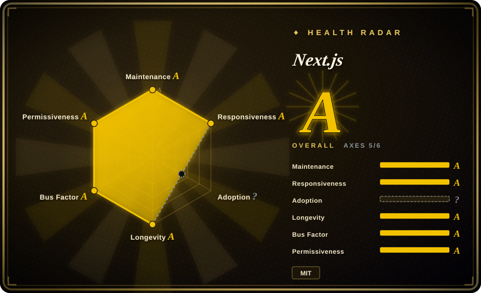

# Next.js

The default full-stack React framework, created and maintained by Vercel. Ships with App Router, React Server Components, automatic static optimization, ISR, and a built-in API layer — with tight Vercel integration as the "happy path."

## When to use

You're a product team building a modern web application that needs to balance SEO, performance, and dynamic interactivity. You start with a simple React SPA but soon hit a wall: search engines can't index your client-rendered content, initial page loads are slow, and your "backend" is a separate API service you have to deploy and maintain. You reach for Next.js because it lets you stay in the React ecosystem while solving these problems natively. You write React components, but some of them render on the server — sending HTML to the browser for instant first paint — while others hydrate into fully interactive client components. You add API routes directly in the same codebase, so your frontend and backend share types, utilities, and deployment. You deploy to Vercel and get edge caching, image optimization, and incremental static regeneration without configuring a CDN. For you, Next.js is the pragmatic choice when "React plus a full-stack framework" is the requirement, not "React plus a week of architecture decisions."

## When NOT to use

- **If you need a simple content-heavy static site without React interactivity, use Astro instead of Next.js, because** Next.js is a React framework at its core. For blogs, documentation, and marketing sites that are mostly static text, Astro's islands architecture delivers smaller bundles and faster loads.
- **If you want to avoid vendor lock-in and Vercel-specific deployment, use Remix or Nuxt instead of Next.js, because** while Next.js is MIT-licensed, some features (Edge runtime, image optimization, certain caching behaviors) are designed around Vercel's infrastructure. Self-hosting is possible but you will fight the framework to match the "happy path" experience.
- **If your team uses Vue, Angular, or Svelte, use Nuxt, Angular, or SvelteKit instead of Next.js, because** Next.js is React-only. There is no incremental adoption path from other frameworks.
- **If you need a lightweight client-side SPA without server rendering, use Vite + React instead of Next.js, because** Next.js's server-rendering pipeline, file-system routing, and build complexity are overkill for a simple SPA. You will carry unnecessary overhead.
- **If you are unwilling to accept framework opinionation, do not use Next.js, because** Next.js is highly opinionated about routing, data fetching, and rendering modes. Fighting the framework (e.g., custom routing, bypassing the App Router conventions) leads to pain and workaround code.
- **If you need zero backend or Node.js runtime, use a static site generator or JAMstack host instead of Next.js, because** Next.js requires a Node.js runtime for SSR, API routes, and middleware. Even "static export" mode has limitations compared to purpose-built static generators.

## Comparison

| Alternative | In index | Our verdict | Tradeoff |
| --- | --- | --- | --- |
| [Angular](angular.md) | ✅ | Full-stack TypeScript framework with deep enterprise tooling and strong opinions. | Angular ships more built-in features and is framework-agnostic of React; Next.js dominates the React SSR/SSG niche and has a larger React job market. |
| [React](react.md) | ✅ | Choose React alone when you want the UI library without Next.js routing, SSR, or full-stack conventions. | React alone gives you maximum flexibility and smaller bundles; Next.js gives you routing, SSR, and full-stack conventions but adds complexity. |
| [Vue.js](vue.md) | ✅ | Choose Vue when you want a progressive non-React framework that is easier to adopt incrementally. | Vue is framework-agnostic and easier to adopt incrementally; Next.js is React-only and more opinionated. |
| [Svelte](svelte.md) | ✅ | Choose Svelte when you want the compile-time component model without committing to React. | Svelte is leaner and simpler for component-heavy small-to-medium apps; Next.js has a vastly larger ecosystem and job market. |
| SvelteKit | 未收录 | Choose SvelteKit when you want a leaner full-stack framework built around Svelte's compile-time model. | SvelteKit is leaner and simpler for small-to-medium apps; Next.js has a vastly larger ecosystem, more mature tooling, and deeper job market. |
| Nuxt.js | 未收录 | Full-stack Vue framework — the Vue ecosystem's equivalent of Next.js. | Nuxt is for Vue teams; Next.js is for React teams. The choice is usually determined by your UI framework preference. |
| Remix | 未收录 | Full-stack React framework focused on web standards, progressive enhancement, and less vendor coupling. | Remix is less opinionated about deployment and avoids some Vercel-specific features; Next.js has more built-in optimizations (image, font, script) and a larger community. |
| Astro | 未收录 | Content-focused static site builder with islands architecture and multi-framework support. | Astro is better for static content sites and mixed-framework projects; Next.js is better for dynamic, full-stack React applications with heavy interactivity. |

## Tech stack

- **React** — the underlying UI library; Next.js is a React framework
- **TypeScript / JavaScript** — primary development languages; first-class TS support
- **Node.js** — runtime for SSR, API routes, middleware, and the build process
- **Turbopack** — Rust-based bundler, successor to Webpack, used in development (production builds still use Webpack as of v15, with Turbopack targeting production)
- **React Server Components** — server-side component rendering in the App Router (v13+), enabling zero-client-js server UI
- **Edge Runtime** — lightweight V8 isolate for Edge API routes, middleware, and Vercel Edge Functions
- **Built-in optimizations** — image optimization (`next/image`), font optimization (`next/font`), and script optimization (`next/script`)
- **ISR (Incremental Static Regeneration)** — hybrid static/dynamic rendering that updates pages in the background without full rebuilds

## Dependencies

- **Node.js (LTS recommended)** — required for the build, dev server, SSR, and API routes
- **React 18+** — peer dependency; Next.js is a React framework and cannot be used without React
- **A package manager** — npm, yarn, pnpm, or bun
- **Optional: Vercel** — for the "happy path" deployment with all features (Edge, image optimization, ISR) working out of the box
- **Optional: Docker / container platform** — for self-hosting the Node.js server in production
- **Optional: Database / ORM** — for full-stack data layers (Prisma, Drizzle, Mongoose, etc. are common pairings)
- **Optional: Redis / cache layer** — for ISR revalidation, session storage, or rate limiting in self-hosted setups

## Ops difficulty

**Medium to High**. Next.js is a full-stack framework with a complex build system and multiple rendering modes (SSG, SSR, ISR, client-side, Edge). Deploying on Vercel is the "happy path" — largely zero-config with edge caching, image optimization, and serverless scaling. Self-hosting increases complexity significantly:
- You must run a Node.js server for SSR, API routes, and middleware; static export mode exists but sacrifices many features
- ISR requires a persistent cache and invalidation strategy; self-hosting means you manage this yourself
- Image optimization (`next/image`) works best with Vercel's edge infrastructure; self-hosting requires a custom loader or a compatible image optimization service
- Middleware and Edge API routes require a V8-isolate-compatible runtime (Node.js 18+ or a custom Edge runtime)
- Build times can be long for large applications; Turbopack improves development speed but production build optimization remains compute-heavy
- The App Router (v13+) introduces new concepts (Server Components, Server Actions, parallel routes) that increase mental overhead and migration cost

## Health & viability

- **Maintenance**: Actively maintained by Vercel with a fast release cadence. The default branch is `canary`, and major versions ship roughly annually. The repo shows consistent daily activity.
- **Governance / bus factor**: Single-vendor governance — Vercel owns the roadmap and employs the core maintainers. The MIT license permits forks, but the ecosystem (templates, tutorials, deployment guides) is Vercel-centric.
- **Backing & longevity**: Vercel is a well-funded company and Next.js is its flagship open-source project. First released in 2016 (~8 years old), making it a strong Lindy prior for a React framework — old enough to have survived multiple paradigm shifts, still actively maintained.
- **Adoption & ecosystem**: The dominant full-stack React framework with ~138k GitHub stars and massive production adoption. Largest ecosystem of starter templates, third-party integrations, and hiring market among React meta-frameworks.
- **Risk flags**: Vendor lock-in tension — some features are optimized for Vercel and degrade or require extra configuration when self-hosted. The App Router migration (v13+) was controversial and disruptive for teams using the Pages Router. No relicense history (remains MIT).

## Caveats (unverified)

- [推断] The exact proportion of Next.js features that degrade when self-hosted versus deployed on Vercel has not been independently benchmarked.
- [未验证] ~138k GitHub stars as of 2026-07; star counts are approximate and time-sensitive.
- [未验证] Turbopack production readiness and exact build-time performance gains over Webpack are based on Vercel marketing claims and may vary by application.
- [推断] The App Router migration friction for existing teams depends heavily on Pages Router usage patterns and third-party library compatibility.
- [推断] The future direction of React Server Components and Server Actions may shift Next.js architecture significantly; long-term stability of the App Router model is still being proven in production at scale.
