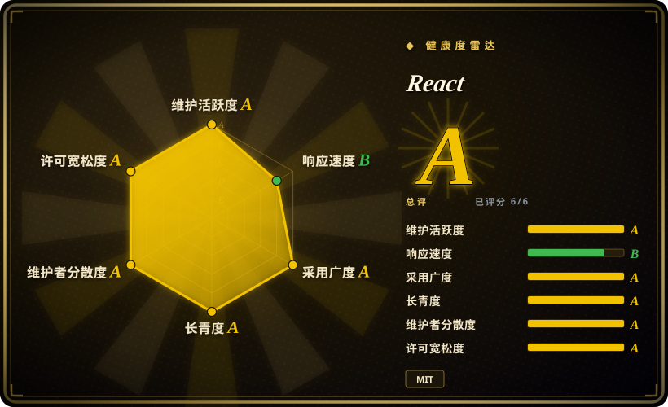

# React

用于构建用户界面的声明式、组件化 JavaScript 库，由 Meta 维护。它是全球采用最广泛的 UI 库，从单页应用到通过 React Native 构建的原生移动应用都有它的身影。

## 何时使用

你是一支前端团队，正在构建一个现代化的 SaaS 仪表盘。你的产品包含数十个交互页面、实时数据表格、复杂表单，并对深度定制有需求。你评估过 Angular，但它的 opinionated 模块系统和样板代码对你们需要的节奏来说显得沉重。你评估过 Vue，但你的团队已精通 JavaScript，且你们想要最深的生态和招聘池。你选择 React，因为它的组件模型让你可以把 UI 拆成可复用、可组合的模块，JSX 让标记直观易懂，而 Hooks 让你不必学习新范式就能管理状态和副作用。生态的丰富意味着几乎任何问题都能找到经过实战检验的库——路由、状态管理、图表、数据表格——而当你后续需要服务端渲染或静态站点生成时，Next.js 可以直接叠加在 React 之上。React 不仅是一个库，更是对职业和生态的投资。

## 何时不用

- **如果你需要一套开箱即用的完整框架，请用 Angular 或 Next.js，而不是 React，因为** React 只是视图层。你必须自己引入路由、状态管理和构建工具链。
- **如果你的团队是前端新手，对 JavaScript 闭包理解困难，请用 Vue，而不是 React，因为** React 的 Hooks 有严格的规则（调用顺序、依赖数组），而闭包过时（stale closure）是初学者常见的陷阱。
- **如果你需要尽可能小的包体积，用于简单组件或落地页，请用 Svelte 或 Preact，而不是 React，因为** React 的虚拟 DOM 和运行时开销比编译时替代方案更大。
- **如果你想要严格的、可预测的架构，又不想自己组装技术栈，请用 Angular，而不是 React，因为** React 本身不强制任何架构范式。团队必须自行组织模式，否则代码容易变得混乱。
- **如果你需要 SEO 优先的静态站点，又不想额外配置，请用 Next.js 或 Nuxt，而不是纯 React，因为** React 默认是客户端渲染，SSR 需要元框架。
- **如果你想要真正的响应式、基于信号的系统，且不想手动做记忆化优化，请用 Solid.js 或 Svelte，而不是 React，因为** React 的重新渲染模型需要显式优化（useMemo、useCallback、memo）才能避免性能陷阱。

## 横向对比

| 替代品 | 是否收录 | 我们的评价 | 取舍 |
| --- | --- | --- | --- |
| [Vue.js](vue.zh.md) | ✅ | 需要渐进式框架、更温和学习曲线和优秀文档时，选 Vue。 | Vue 更容易增量采纳；React 生态更大、就业市场更深。 |
| [Angular](angular.zh.md) | ✅ | 由 Google 构建的综合性、opinionated TypeScript 框架，面向企业级应用。 | Angular 内置一切；React 更灵活，但需要你自己组装技术栈。 |
| [Svelte / SvelteKit](svelte.zh.md) | ✅ | 需要编译时组件、极小运行时和无虚拟 DOM 时，选 Svelte。 | Svelte 对中小型应用更快更简单；React 生态庞大得多，招聘更容易。 |
| [Next.js](nextjs.zh.md) | ✅ | 需要默认的全栈 React 框架、一流 SSR/SSG 和 Vercel 生态时，选 Next.js。 | Next.js 是 React 加上路由、SSR 和部署；当你需要这些功能时用它，想要更轻量、更可控的 setup 时用纯 React。 |
| [shadcn/ui](shadcn-ui.zh.md) | ✅ | 构建在 React 之上的组件分发模式——不是替代品，而是常见搭档。 | shadcn/ui 提供可复制的粘贴组件；它不是独立的 UI 库。 |
| [Ant Design](ant-design.zh.md) | ✅ | 企业级 React 组件库，拥有全面的预置组件。 | Ant Design 是 React 内部使用的样式组件套件；它不是 React 的替代品。 |
| [Driver.js](driver-js.zh.md) | ✅ | 轻量、零依赖的导览和聚光灯库。 | 不是 UI 框架的替代品；与 React 配合使用做 onboarding 导览。 |

## 技术栈

- **JavaScript / TypeScript** —— React 本身用 JavaScript 编写，附带 TypeScript 类型定义；你可以用任一语言编写组件
- **JSX** —— 语法扩展，允许你在 JavaScript 中编写类似 HTML 的标记
- **虚拟 DOM** —— 轻量级的内存中 DOM 表示，React 用它批量和优化 UI 更新
- **Hooks** —— 函数组件的状态和生命周期原语（useState、useEffect、useContext 等），取代了类组件
- **React Server Components (RSC)** —— React 18+ 引入的新架构，让组件仅在服务端渲染，模糊了客户端与服务端的边界
- **React Native** —— 独立但相关的框架，使用 React 组件构建原生移动应用
- **Concurrent Features** —— 现代渲染引擎（React 18 引入），支持 Suspense、transitions 和基于优先级的更新

## 依赖

- **Node.js** —— 构建工具所需的 Runtime（建议 LTS）
- **现代浏览器** —— React 支持 evergreen 浏览器；React 18 起已放弃 IE11 支持
- **构建工具链** —— 需要能处理 JSX 的打包器（Vite、Next.js、webpack、Parcel 或 esbuild）
- **ReactDOM** —— 渲染到 DOM 的必需 peer dependency
- **可选：React Router / TanStack Router** —— 客户端路由（React 没有内置路由器）
- **可选：Redux / Zustand / Jotai / Recoil** —— useState / useContext 之外的状态管理方案
- **可选：Next.js / Remix** —— 用于 SSR、SSG 和全栈能力
- **可选：React Native** —— 构建原生移动应用（独立工具链）

## 运维难度

**低到中**。React 是客户端库，部署即静态包。运维负担来自所需的组装工作：
- 你必须自行选择、配置和维护路由器、状态管理和构建管线
- 你必须理解并应用性能优化（useMemo、useCallback、React.memo、代码分割），否则重新渲染会拖慢用户体验
- React Server Components（RSC）引入了服务端运行时，增加了部署复杂度（Node.js 服务器、流式传输、缓存）
- 主版本升级通常向后兼容，但可能需要 codemods（例如过去的 class-to-hooks 迁移）
- 生态演进很快；在大量第三方库之间保持依赖更新是一项真实的维护成本

## 健康度与可持续性

- **维护活跃度（2026-07）。** React 由 Meta 的大型团队积极开发，频繁发布小版本，并有公开的 RFC 流程。仓库显示每日活跃。
- **治理与 bus factor。** Meta 主导路线图，但 React 采用 MIT 许可证，拥有广泛的外部贡献者基础。核心团队足够大，没有单点故障。RFC 流程以及独立的 Next.js / Vercel 生态对 Meta 的独家控制权形成制衡。
- **背书与长青度。** 自 2013 年起由 Meta 维护（约 13 年），至今仍是前端领域的主导库。Lindy 先验很强：一个已经主导市场超过十年的项目，比任何新秀都更安全。生态规模足以支撑社区分叉，即使 Meta 的战略优先级发生变化。
- **采用度与生态。** 最深的招聘池、最多的 Stack Overflow 答案、最大的第三方库生态。React 是训练营教学和企业代码库的默认选择。生态包括 Next.js、React Native 和无数组件库。
- **风险信号。** 没有重大重新许可历史（始终保持 MIT）。open-core 风险较低，因为 React 本身完全开源。React Server Components 是范式转变，使生态在不同框架（Next.js、Remix 等）之间碎片化，可能带来长期可移植性顾虑。

## 存疑（未验证）

- [未验证] 截至 2026-07 约 235k GitHub stars；star 数量是近似值且随时间变化。
- [未验证] React 19 的确切功能集以及 Server Components 在生态中的采纳率未经独立验证。
- [推断] Meta 对 React 的长期战略承诺很强，但无合同保障；路线图跟随 Meta 的内部优先级。
- [推断] React 虚拟 DOM 相对于编译时框架（Svelte、Solid.js）的性能开销因应用和优化程度而异。
- [推断] React 的「Hooks 规则」（只能在顶层调用，只能从 React 函数中调用）和闭包过时问题是常见初学者陷阱，但因此导致生产 bug 的确切频率未经过测量。
- [推断] 就业市场主导地位的声明是从行业调查和招聘数据推断而来，并非严格的普查。
