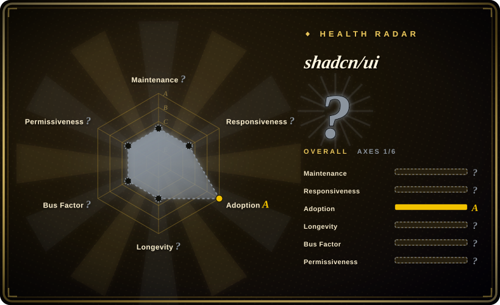

# shadcn/ui

A set of beautifully-designed, accessible React components and a code distribution platform that you copy into your project and own completely — built on Tailwind CSS and Radix UI primitives.

## When to use

You're a React developer building a new product and you need a solid, accessible UI foundation. You consider Material UI, but its theming system forces you to override layers you don't control, and its visual language is unmistakably Google. You consider Radix UI, but it is just unstyled primitives — you would still need to build every button, dialog, and dropdown from scratch. You choose shadcn/ui because it splits the difference: it gives you pre-built, polished components that look great out of the box, but copies them into your repo as source files you fully own. You run `npx shadcn@latest add button dialog`, and the components land in your codebase using Tailwind CSS for styling and Radix UI for accessibility and behavior. You get keyboard navigation, ARIA attributes, and focus management for free, while the visual layer is yours to customize without waiting for a library update.

You also reach for it when you want a design system that stays in your repo, not in `node_modules`. Because shadcn/ui is a copy-and-own model, there is no runtime dependency to version-lock or worry about breaking changes from upstream. If the upstream project adds a new component, you can selectively adopt it; if you need a bespoke variant, you edit the copied file directly. This is why you pick shadcn/ui over Chakra UI or MUI — you want to own every pixel without rebuilding primitives from zero.

## When NOT to use

- **If you use Vue, Angular, or Svelte, use Vuetify, Angular Material, or Skeleton UI instead of shadcn/ui, because** it is React-only and there is no equivalent copy-paste component ecosystem for those frameworks.
- **If you want a zero-config UI kit where you never touch component code, use Material UI or Chakra UI instead of shadcn/ui, because** shadcn/ui requires you to own and maintain the component files in your repo. Importing `<Button>` and never looking at its implementation is not how this model works.
- **If you need a strict, enterprise-grade design system with governance and design tokens, use Ant Design or MUI instead of shadcn/ui, because** shadcn/ui is a starting point, not a governed design system. It does not enforce token usage, component usage rules, or visual consistency across teams — you must build that governance yourself.
- **If you are already committed to another component library, use that library instead of migrating to shadcn/ui, because** switching from Material UI, Ant Design, or Chakra means replacing components one by one and rebuilding your theme layer in Tailwind. The payoff is ownership, but the migration cost is real.
- **If you need complex data-grid or chart components out of the box, use AG Grid, TanStack Table, or Recharts instead of shadcn/ui, because** shadcn/ui provides primitives and basic table patterns; for heavy data grids, pivot tables, or charts, you will need dedicated libraries anyway.
- **If you don't use Tailwind CSS, use Chakra UI or MUI instead of shadcn/ui, because** the components are styled with Tailwind utility classes; if your project uses CSS-in-JS, Styled Components, or plain CSS, you will need to rewire the styling layer entirely.

## Comparison

| Alternative | In index | Our verdict | Tradeoff |
| --- | --- | --- | --- |
| Material UI (MUI) | 未收录 | Choose MUI when you need a comprehensive Google-Material-themed component library with a large enterprise ecosystem. | Comprehensive Google-Material-themed React component library with enterprise adoption and paid support; heavier and more opinionated than shadcn/ui. |
| Chakra UI | 未收录 | Choose Chakra UI when you want a simpler, styled-system-based React component library with good DX. | Simple, styled-system-based React library with good DX and a consistent theme API; less customizable at the file level than shadcn/ui's copy-and-own model. |
| [Ant Design](ant-design.md) | ✅ | Choose Ant Design when you need a full-featured enterprise UI framework with many built-in components. | Full-featured enterprise UI framework with a vast component set and Chinese-first community; heavier and less Tailwind-native than shadcn/ui. |
| Radix UI | 未收录 | Choose Radix UI when you need headless, unstyled primitives and plan to build your own styling layer from scratch. | Headless, unstyled accessibility primitives; shadcn/ui builds on Radix and adds Tailwind styling and a distribution workflow. |
| Headless UI | 未收录 | Choose Headless UI when you want Tailwind-compatible, unstyled components from the Tailwind team. | Tailwind-team-authored unstyled components; fewer primitives than Radix and no built-in "copy to own" distribution system. |

## Tech stack

- **Language:** TypeScript, compiled to JavaScript; all components are typed and tree-shakeable.
- **Styling:** Tailwind CSS utility classes for all visual styles; no separate CSS file or CSS-in-JS runtime.
- **Primitives:** Built on Radix UI primitives for accessibility (ARIA, keyboard navigation, focus trapping, portal behavior) and behavior (dialogs, dropdowns, accordions, etc.).
- **Distribution:** CLI (`npx shadcn@latest add <component>`) copies source files into your project's `components/ui/` directory; no npm dependency on the component library itself.
- **Framework support:** Optimized for Next.js and React 18+; also works with Vite, Remix, and other React frameworks.

## Dependencies

- **Runtime:** React 18+ and a Tailwind CSS project. The components assume Tailwind is configured and its utility classes are available in your build.
- **Library deps:** The copied components may pull in small Radix UI sub-packages and `clsx` / `tailwind-merge` for class merging; these are normal runtime dependencies you already manage.
- **No backend:** It is a client-side UI library; no server, database, or service required.
- **Build integration:** Your bundler (Vite, Next.js, webpack) must process Tailwind CSS and the TypeScript/JSX component files.

## Ops difficulty

**Low.** There is nothing to deploy or operate beyond your normal React build pipeline. The operational burden is in **maintenance of the copied components**: when you upgrade the shadcn/ui CLI or add a new component, you may need to reconcile styling changes or Tailwind config updates. Because the components live in your repo, you must patch them yourself if a bug is found — you cannot just bump a version in `package.json`. The flip side is that you are never blocked by upstream release cadence. For a small team, the copy-and-own model is low-friction; for a large org with many teams, you may need to build your own internal distribution mechanism to keep component variants consistent.

## Health & viability
- **Maintenance**: Grade A — 13/13 active weeks in trailing 13; last commit 0 days ago.
- **Responsiveness**: Grade A — median first-response time 14.7 hours across 28 qualifying issues/PRs.
- **Adoption**: Grade A — 18,842,516 monthly downloads via npmjs.org (package: shadcn).
- **Longevity**: Grade B — 1275 days old.
- **Governance**: Cannot be scored — unknown.
- **Risk / License**: Grade A — MIT license.
## Caveats (unverified)

- [未验证] ~117.7k GitHub stars as of 2026-07-01; star counts are approximate and time-sensitive.
- [未验证] The exact React version compatibility and framework support (Next.js, Vite, Remix) shift with the CLI releases; verify the current docs before installing.
- [未验证] The `npx shadcn` CLI distribution model and available component registry are evolving rapidly; the exact set of installable components and their options may change.
- [推断] The copy-and-own model means you are responsible for merging upstream fixes into your local component files; there is no automatic patch mechanism.
- [推断] Large organizations may struggle with consistency across multiple teams each copying and modifying components independently; internal governance is required.
- [推断] While the primitives are accessible, the final accessibility of your application depends on how you compose and configure the copied components in your own code.
- [推断] Framework support beyond Next.js and React 18+ varies by CLI version and may require manual configuration.
