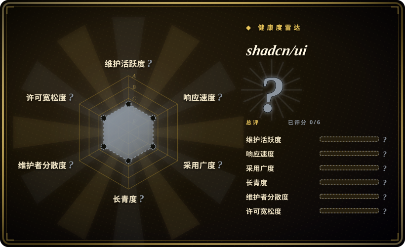

# shadcn/ui

一套精心设计、无障碍的 React 组件，以及一种代码分发平台——你把组件复制进项目，完全拥有它们。基于 Tailwind CSS 和 Radix UI 原语构建。

## 何时使用

你是 React 开发者，正在开发新产品，需要一套可靠、无障碍的 UI 基础，又不想和第三方组件库的主题系统打架。你想要开箱即好看、但又能修改每个像素的按钮、对话框、下拉菜单、表格和表单——颜色、间距、动画——无需覆盖 CSS 层或等库更新。你跑 `npx shadcn@latest add button dialog`，组件就直接以源文件形式复制进你的代码库，归你所有。它们用 Tailwind CSS 做样式，用 Radix UI 处理无障碍和行为，所以你免费拿到键盘导航、ARIA 属性和焦点管理，而视觉层由你完全自定义。

当你想要一个留在仓库里、不在 `node_modules` 里的设计系统时，你也会选它。因为 shadcn/ui 是复制-拥有模式，没有运行时依赖需要版本锁定或担心上游破坏性变更。如果上游加了新组件，你可以选择性采用；如果你需要定制变体，直接编辑复制进来的文件即可。

## 何时不用

- **你不用 React。** shadcn/ui 仅限 React；该生态没有 Vue、Angular 或 Svelte 的对应版本。其他框架请用各自的组件库。
- **你想要零配置、不用碰代码的 UI kit。** shadcn/ui 要求你在仓库里拥有并维护组件文件。如果你更喜欢 import `<Button>` 后从不看实现的方式，请用 Material UI 或 Chakra UI。
- **你需要严格的企业级设计系统与治理。** shadcn/ui 是起点，不是受治理的设计系统。它不强制 token 使用、组件使用规则或跨团队视觉一致性——你必须自己建立治理。
- **你已经深度绑定另一个组件库。** 从 Material UI、Ant Design 或 Chakra 迁移到 shadcn/ui 意味着逐个替换组件，并在 Tailwind 里重建主题层。回报是所有权，但迁移成本真实存在。
- **你需要开箱即用的复杂数据网格或图表组件。** shadcn/ui 提供原语和基础表格模式；重型数据网格、透视表或图表需要集成专用库（TanStack Table、AG Grid、Recharts 等）。
- **你不用 Tailwind CSS。** 组件用 Tailwind 工具类样式；如果你的项目用 CSS-in-JS、Styled Components 或纯 CSS，需要把整个样式层重新接线。

## 横向对比

| 替代品 | 是否收录 | 我们的评价 | 取舍 |
|---|---|---|---|
| Material UI（MUI） | 未收录 | 当前页用于它的主场景；如果更看重「全面、Google Material 主题的组件库，拥有庞大企业生态」，再选 MUI。 | 全面、Google-Material 主题的 React 组件库，企业采用广泛，有付费支持；比 shadcn/ui 更重、更有主见。 |
| Chakra UI | 未收录 | 当前页用于它的主场景；如果更看重「更简单、基于 styled-system 的 React 组件库，DX 好」，再选 Chakra UI。 | 简单、基于 styled-system 的 React 库，DX 好，主题 API 一致；文件级可定制性不如 shadcn/ui 的复制-拥有模式。 |
| Ant Design | 未收录 | 当前页用于它的主场景；如果更看重「全功能企业级 UI 框架，内置组件极多」，再选 Ant Design。 | 全功能企业级 UI 框架，组件集庞大，社区以中文为先；比 shadcn/ui 更重，也不那么 Tailwind 原生。 |
| Radix UI | 未收录 | 当前页用于它的主场景；如果更看重「无样式、headless 原语，计划从零自建样式层」，再选 Radix UI。 | 无样式、headless 无障碍原语；shadcn/ui 在 Radix 之上加了 Tailwind 样式和分发工作流。 |
| Headless UI | 未收录 | 当前页用于它的主场景；如果更看重「Tailwind 团队出品的无样式组件」，再选 Headless UI。 | Tailwind 团队维护的无样式组件；原语比 Radix 少，没有内置的「复制到自有」分发系统。 |

## 技术栈

- **语言：** TypeScript，编译为 JavaScript；所有组件带类型，支持 tree-shaking。
- **样式：** Tailwind CSS 工具类负责全部视觉样式；没有单独的 CSS 文件或 CSS-in-JS 运行时。
- **原语：** 基于 Radix UI 原语实现无障碍（ARIA、键盘导航、焦点捕获、portal 行为）与交互（对话框、下拉菜单、手风琴等）。
- **分发：** CLI（`npx shadcn@latest add <component>`）把源文件复制到你项目的 `components/ui/` 目录；组件库本身不作为 npm 依赖存在。
- **框架支持：** 针对 Next.js 和 React 18+ 优化；也支持 Vite、Remix 和其他 React 框架。[未验证]

## 依赖

- **运行时：** React 18+ 和 Tailwind CSS 项目。组件假设 Tailwind 已配置且工具类在构建中可用。
- **库依赖：** 复制进来的组件可能引入少量 Radix UI 子包和 `clsx` / `tailwind-merge` 做类名合并；这些是你已经在管理的正常运行时依赖。
- **无后端：** 客户端 UI 库，无需服务器、数据库或服务。
- **构建集成：** 你的打包器（Vite、Next.js、webpack）必须处理 Tailwind CSS 和 TypeScript/JSX 组件文件。[推断]

## 运维难度

**低。** 除了正常的 React 构建管线，没有额外东西要部署或运维。运维负担在于**复制组件的维护**：升级 shadcn/ui CLI 或添加新组件时，可能需要调和样式变更或 Tailwind 配置更新。因为组件活在仓库里，发现 bug 时你必须自己 patch——不能简单在 `package.json` 里升版本。好处是你永远不会被上游发布节奏卡住。对小团队而言，复制-拥有模式摩擦很小；对大型组织多团队而言，可能需要自建内部分发机制，以保持组件变体一致性。[推断]

## 健康度与可持续性

- **维护（2026-07）。** 最后 push 于 2026-06-30，提交历史非常活跃，发布频繁；项目未归档，社区繁荣。[推断]
- **治理 / bus factor。** 归属 `shadcn-ui` GitHub 组织（多维护者），shadcn 作为可见核心。项目社区贡献强，CLI 驱动的分发模式清晰。[推断]
- **年龄与 Lindy 判断。** 约 2.5 年（2023-01 创建），极受欢迎 ⇒ 对 UI 库而言是**中等 Lindy** 信号；它已成为现代 Tailwind 生态中 React 组件分发模式的主导者。[推断]
- **采用度与生态。** 约 117.7k star，在 Next.js、SaaS 和开源项目中被大规模采用。「复制-拥有」模式已影响众多其他组件库。[未验证]
- **风险标记。** MIT 许可，无 relicense 历史。主要风险是**生态耦合**：项目与 React + Tailwind CSS + Radix UI 深度绑定；若其中任何一方大幅变动（如 React Server Components 行为变更、Tailwind v4 破坏性变更），仓库里的组件文件可能需要手动更新。[推断]

## 存疑（未验证）

- [未验证] 截至 2026-07-01 约 117.7k GitHub star；star 数为近似值且对时间敏感。
- [未验证] React 版本兼容性和框架支持（Next.js、Vite、Remix）随 CLI 版本变动；安装前请核实当前文档。
- [未验证] `npx shadcn` CLI 分发模式和可安装组件注册表正在快速演进；可安装组件集合及其选项可能变化。
- [推断] 复制-拥有模式意味着你需要自行把上游修复合并到本地组件文件中；没有自动补丁机制。
- [推断] 大型组织可能难以在多个团队各自复制和修改组件的情况下保持一致性；需要内部治理。
- [推断] 虽然原语本身无障碍，但最终应用的无障碍程度取决于你如何在自己的代码中组合和配置这些复制进来的组件。
