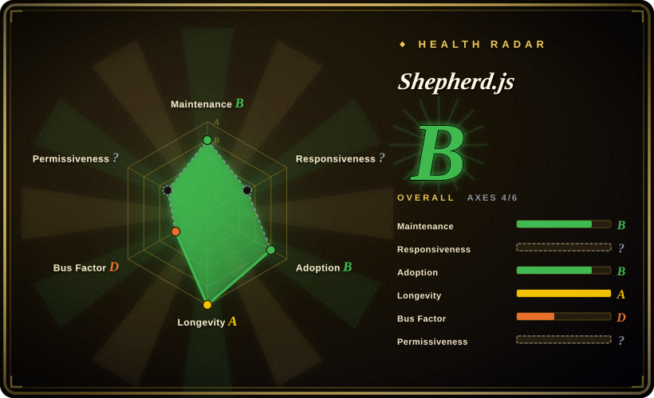

# Shepherd.js

A JavaScript library for creating guided user tours and product onboarding experiences, built on Floating UI for robust step positioning, with a framework-agnostic core and an optional React wrapper.

## When to use

You're a frontend lead at an enterprise SaaS company, and product has asked for a polished, multi-step onboarding tour that walks new users through the dashboard, highlights key features, and tracks progress. The app is built with React, but you also need to support a Vue-based admin panel and vanilla JS marketing pages with the same tour logic. You need reliable positioning — the tour steps must align to dynamically-sized elements, handle scroll and resize, and even work across multiple pages. You reach for Shepherd.js: you `npm install shepherd.js`, configure steps with titles, descriptions, and target selectors, and it renders the tour overlay, the spotlight highlighting, and the popover steps using Floating UI for positioning. The React wrapper (`react-shepherd`) gives you hooks and JSX-native components, while the core library works in any framework. You get built-in prev/next navigation, progress indicators, and theming support out of the box.

## When NOT to use

- **You need the smallest possible bundle.** Shepherd.js bundles Floating UI for positioning, which adds significant weight (~20KB+ gzipped) compared to Driver.js's ~4KB dependency-free core. If your only need is a minimal feature highlight or a two-step tour, the overhead is not worth it.
- **You need a full onboarding *platform* with analytics, segmentation, and A/B testing.** Shepherd.js is a rendering library for tours, not an adoption platform. It has no built-in user tracking, no checklists, no NPS surveys, and no "show this tour to users who haven't done X" logic. For that, you need commercial tools like Appcues / Userflow / Userpilot, or you'll build the state layer yourself.
- **You want a React-native tour component with the smallest possible footprint.** While `react-shepherd` exists, it wraps the core library. If your app is React-only and you want a lighter, JSX-native tour experience, consider Reactour or react-joyride instead.
- **You need deep, conditional tour branching out of the box.** Multi-path tours with complex branching (skip steps based on user role, resume across sessions, branch on user action) require custom orchestration in your own code; Shepherd.js provides steps and an imperative API, not a built-in flow engine.
- **You want zero-dependency positioning.** Shepherd.js relies on Floating UI (formerly Popper.js) for positioning. If you need complete control over positioning logic or want to avoid any dependency, Driver.js is the lighter alternative.

## Comparison

| Alternative | In index | Our verdict | Tradeoff |
|---|---|---|---|
| [Driver.js](driver-js.md) | ✅ | Use this page for its stated niche; choose [Driver.js](driver-js.md) when you need a tiny, dependency-free tour library with minimal bundle size. | ~4KB dependency-free core; smaller footprint but fewer built-in positioning options and a simpler API. |
| Intro.js | 未收录 | Use this page for its stated niche; choose Intro.js when you want the original tour library. | The original tour library; widely used but its modern usage is **dual-licensed** (free for non-commercial, paid commercial license) — a real lock-in/cost consideration Shepherd.js (MIT) avoids. |
| Reactour / react-joyride | 未收录 | Use this page for its stated niche; choose Reactour / react-joyride when you need React-specific tour components with native hooks/JSX. | React-specific tour components (hooks/JSX-native); nicer DX inside React, but framework-locked vs Shepherd.js's framework-agnostic core. |
| Appcues / Userflow / Userpilot | 未收录 | Use this page for its stated niche; choose Appcues / Userflow / Userpilot when you need commercial no-code onboarding **platforms**. | Commercial no-code onboarding **platforms** — segmentation, analytics, targeting, checklists, surveys; not open-source repos, recurring SaaS cost, but solve product-led-growth, not just tour rendering. |
| Bootstrap Tour | 未收录 | Use this page for its stated niche; avoid Bootstrap Tour for new work — it is abandoned. | Built for Bootstrap 3/4 era; effectively abandoned. Do not use for new projects. |
| Angular CDK stepper | 未收录 | Use this page for its stated niche; choose Angular CDK stepper when you need Angular-native step-by-step UI flows within the Angular ecosystem. | Angular-native stepper component; not a general-purpose tour/overlay library and Angular-only. |

## Tech stack

- **Language:** JavaScript / TypeScript — the core is written in TypeScript and compiled to JavaScript; ESM and UMD builds are published to npm.
- **Positioning:** Floating UI (formerly Popper.js) — used for robust, adaptive step positioning relative to target elements, handling scroll, resize, and viewport boundaries.
- **Rendering:** Pure DOM + CSS overlay and spotlight — injects an overlay, highlight cutout, and popover into the page; themable via CSS variables and class overrides.
- **Framework support:** Framework-agnostic core with optional wrappers — `react-shepherd` provides React hooks and components; the core works in Vue, Angular, Svelte, or vanilla JS.
- **API:** Imperative API with step configuration (`Tour`, `Step`, `next()`, `back()`, `complete()`) plus lifecycle hooks.

## Dependencies

- **Runtime:** Floating UI is the primary runtime dependency (bundled with Shepherd.js). The library runs entirely client-side in the browser; no backend, no server, no database required.
- **Build (for app authors):** A bundler that resolves the npm package (Vite, webpack, esbuild, Rollup) and imports both the JS and its CSS. Usable framework-free or inside any framework.
- **Browser:** Modern evergreen browsers; exact minimum/legacy support is version-dependent — verify against the target browser matrix. [未验证]
- **React wrapper:** If using `react-shepherd`, React is a peer dependency.

## Ops difficulty

**Low.** This is a client-side library, not a service — there is nothing to deploy or operate. "Ops" here is just: add the dependency, ship the JS+CSS in your bundle, and you're done; no server, no datastore, no scaling concern. The real cost is **integration/maintenance** in your own app: defining the steps, keeping selectors in sync as the UI changes (a tour silently breaks when you rename a class or restructure the DOM), handling SPA timing, and theming. Additionally, because Shepherd.js uses Floating UI, you inherit its positioning behavior and any breaking changes from that dependency — though Floating UI is a stable, well-maintained project.

## Health & viability

- **Maintenance (2026-07).** Active development at v12.x; the project is maintained by Ship Shape (a consultancy), with regular releases and a responsive issue tracker. Not archived.
- **Governance / bus factor.** Maintained by Ship Shape, a software consultancy — not a single personal account, but a small vendor. The bus factor is better than a solo maintainer but still tied to one company's priorities. MIT-licensed, so a fork is viable if maintenance ever lapses.
- **Age & Lindy verdict.** The project has been around for several years and is actively maintained — a moderate Lindy signal. It is not a brand-new hype repo, but it also doesn't have the decade-plus track record of some older libraries. [推断]
- **Adoption & ecosystem.** ~7k GitHub stars, good documentation and examples, with a React wrapper (`react-shepherd`) and real-world use in enterprise SaaS onboarding. Lower star count than Driver.js but targeted at a more specific use case (complex multi-step tours). [未验证]
- **Risk flags.** No relicense history found; plain MIT license. No open-core gating or CLA requirements. The main risk is the dependency on Floating UI — a stable but external project — and the smaller community size compared to more mainstream libraries. [推断]

## Caveats (unverified)

- [未验证] ~7k GitHub stars as of 2026-07; star counts are approximate and time-sensitive.
- [未验证] Bundle size ("~20KB+ gzipped") is inferred from the Floating UI dependency plus Shepherd.js core; measure against your actual build rather than quoting a fixed number.
- [未验证] The exact browser support matrix and minimum version requirements vary by release; verify against the version you pin.
- [推断] The "enterprise SaaS onboarding" use case is a common framing for Shepherd.js but verify that the current version's features (progress indicators, multi-page tours, modal steps) match your specific requirements.
- [推断] Ship Shape's long-term commitment to Shepherd.js is inferred from recent activity; consultancies may shift priorities based on client work.
