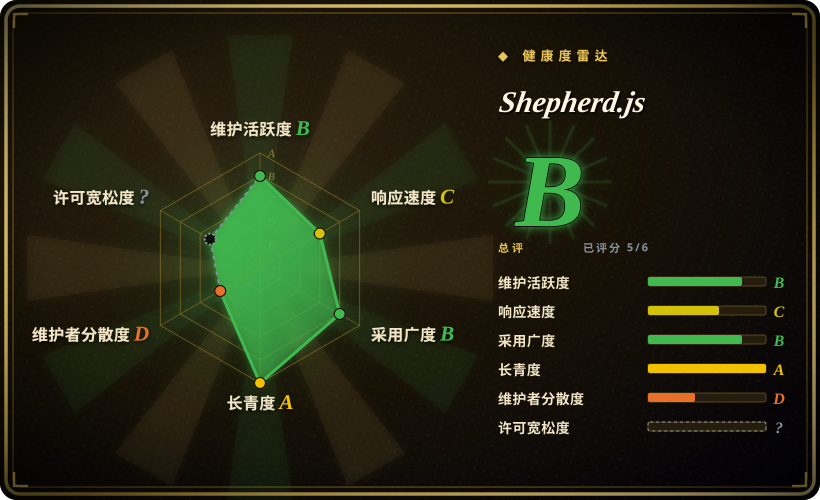

# Shepherd.js

一个用于创建引导式用户旅程和产品上手体验的 JavaScript 库，基于 Floating UI 实现稳健的步骤定位，核心框架无关，并可选配 React 封装。

## 何时使用

你是一家企业 SaaS 公司的前端负责人，产品团队要求你实现一个精致的多步骤新手引导流程，带领新用户浏览仪表盘、突出核心功能并展示进度。你的应用基于 React 构建，但还需要在同一个引导逻辑下支持基于 Vue 的管理后台和纯 JS 的营销页面。你需要可靠的定位能力——引导步骤必须对齐到动态尺寸的元素，处理滚动、窗口大小调整，甚至跨页面工作。你选择 Shepherd.js：运行 `npm install shepherd.js`，配置包含标题、描述和目标选择器的步骤，它便会渲染引导遮罩、高亮聚焦和浮动步骤卡片，并使用 Floating UI 进行定位。React 封装（`react-shepherd`）为你提供 hooks 和 JSX 原生组件，而核心库可在任何框架中运行。你内置获得了上一步/下一步导航、进度指示器和主题定制支持。

## 何时不用

- **你需要尽可能小的包体积。** Shepherd.js 为了定位功能打包了 Floating UI，这使其体积显著增加（gzip 后约 20KB+），而 Driver.js 的零依赖核心仅约 4KB。如果你只需要一个最小化的功能高亮或两步引导，这个开销不值得。
- **你需要一个完整的 onboarding *平台*，包含分析、用户分群和 A/B 测试。** Shepherd.js 是一个引导渲染库，而非用户采用平台。它没有内置的用户追踪、待办清单、NPS 调研，也没有“向未完成 X 的用户展示此引导”的逻辑。如需这些功能，你需要使用 Appcues / Userflow / Userpilot 等商业工具，或自行构建状态管理层。
- **你想要一个体积最小的 React 原生引导组件。** 虽然 `react-shepherd` 存在，但它封装了核心库。如果你的应用纯用 React，且希望获得更轻量、更原生的 JSX 引导体验，应考虑 Reactour 或 react-joyride。
- **你需要开箱即用的深度条件分支引导。** 基于用户角色跳过步骤、跨会话恢复、根据用户行为分支等复杂多路径引导，需要你在自己的代码中编写自定义编排逻辑；Shepherd.js 提供的是步骤和命令式 API，而非内置的流程引擎。
- **你想要零依赖的定位方案。** Shepherd.js 依赖 Floating UI（前身为 Popper.js）进行定位。如果你需要完全控制定位逻辑或想避免任何依赖，Driver.js 是更轻量的替代方案。

## 横向对比

| 替代品 | 是否收录 | 我们的评价 | 取舍 |
|---|---|---|---|
| [Driver.js](driver-js.zh.md) | ✅ | 需要一个极小、零依赖的引导库时，选 Driver.js。 | 约 4KB 的零依赖核心；体积更小，但内置定位选项较少，API 也更简单。 |
| Intro.js | 未收录 | 使用本页针对的场景；当你想要“原版”引导库时选择 Intro.js。 | 原版引导库，使用广泛，但现代版本采用**双重授权**（非商业免费，商业付费）——这是 Shepherd.js（MIT）能够避免的真实的锁定/成本考量。 |
| Reactour / react-joyride | 未收录 | 使用本页针对的场景；当你需要 React 专属的引导组件（原生 hooks/JSX）时选择它们。 | React 专属引导组件（hooks/JSX 原生）；在 React 内开发体验更好，但框架锁定，不如 Shepherd.js 的框架无关核心灵活。 |
| Appcues / Userflow / Userpilot | 未收录 | 使用本页针对的场景；当你需要商业化的无代码 onboarding **平台**时选择它们。 | 商业无代码 onboarding **平台**——包含用户分群、分析、定向、清单、调研；不是开源仓库，需持续支付 SaaS 费用，但解决的是产品驱动增长问题，而非单纯的引导渲染。 |
| Bootstrap Tour | 未收录 | 使用本页针对的场景；新项目应避免使用 Bootstrap Tour——它已停止维护。 | 为 Bootstrap 3/4 时代构建；实际上已废弃。新项目请勿使用。 |
| Angular CDK stepper | 未收录 | 使用本页针对的场景；当你在 Angular 生态内需要 Angular 原生的分步 UI 流程时选择它。 | Angular 原生分步组件；不是通用引导/遮罩库，且仅支持 Angular。 |

## 技术栈

- **语言：** JavaScript / TypeScript——核心使用 TypeScript 编写并编译为 JavaScript；发布到 npm 的包含 ESM 和 UMD 构建产物。
- **定位：** Floating UI（前身为 Popper.js）——用于实现稳健、自适应的步骤定位，相对于目标元素进行定位，并处理滚动、窗口大小调整和视口边界。
- **渲染：** 纯 DOM + CSS 遮罩与聚焦高亮——向页面注入遮罩层、高亮镂空和浮动卡片；可通过 CSS 变量和类覆盖进行主题定制。
- **框架支持：** 框架无关的核心，并可选封装——`react-shepherd` 提供 React hooks 和组件；核心库可在 Vue、Angular、Svelte 或纯 JS 中使用。
- **API：** 命令式 API，支持步骤配置（`Tour`、`Step`、`next()`、`back()`、`complete()`）及生命周期钩子。

## 依赖

- **运行时：** Floating UI 是主要的运行时依赖（与 Shepherd.js 一起打包）。该库完全在浏览器客户端运行；无需后端、服务器或数据库。
- **构建（应用开发者）：** 需要能解析 npm 包的打包工具（Vite、webpack、esbuild、Rollup），并同时导入 JS 和 CSS。可在无框架环境或任何框架内使用。
- **浏览器：** 现代 evergreen 浏览器；最低版本/旧版浏览器支持因版本而异——请对照目标浏览器矩阵进行验证。[未验证]
- **React 封装：** 如果使用 `react-shepherd`，React 为 peer dependency。

## 运维难度

**低。** 这是一个客户端库，不是服务——无需部署或运维。这里的“运维”仅仅是：添加依赖、将 JS+CSS 打包进你的构建产物，仅此而已；没有服务器、没有数据存储、没有扩容顾虑。真正的成本在于你应用中的**集成与维护**：定义步骤、保持选择器与 UI 变更同步（当你重命名类或重构 DOM 时，引导会静默失效）、处理 SPA 时机问题、以及主题定制。此外，由于 Shepherd.js 使用 Floating UI，你会继承其定位行为以及该依赖可能带来的破坏性变更——不过 Floating UI 本身是一个稳定且维护良好的项目。

## 健康度与可持续性

- **维护（2026-07）。** 活跃开发中，版本为 v12.x；项目由 Ship Shape（一家咨询公司）维护，定期发布版本，问题追踪响应及时。未归档。
- **治理 / 单点故障风险。** 由 Ship Shape（软件咨询公司）维护——不是个人账号，但仍是一家小型供应商。单点故障风险优于单人维护项目，但仍与该企业的优先级绑定。采用 MIT 许可证，若维护停滞，可方便地进行分叉。
- **年龄与 Lindy 判断。** 该项目已存在数年且仍在积极维护——属于中等 Lindy 信号。它并非全新的炒作型仓库，但也没有一些更老牌库那样超过十年的跟踪记录。[推断]
- **采用与生态。** 约 7k GitHub stars，文档和示例良好，拥有 React 封装（`react-shepherd`），并在企业 SaaS onboarding 中有实际使用。Star 数低于 Driver.js，但面向更具体的场景（复杂多步骤引导）。[未验证]
- **风险信号。** 未发现重新授权历史；采用 plain MIT 许可证。无开放核心限制或 CLA 要求。主要风险在于对 Floating UI 的依赖——这是一个稳定但外部的项目——以及相比主流库更小的社区规模。[推断]

## 存疑（未验证）

- [未验证] 截至 2026-07 约 7k GitHub stars；star 数为近似值且随时间变化。
- [未验证] 包体积（“gzip 后约 20KB+”）是根据 Floating UI 依赖加上 Shepherd.js 核心推断的；请在你的实际构建中测量，而非引用固定数字。
- [未验证] 具体的浏览器支持矩阵和最低版本要求因版本而异；请对照你锁定的版本进行验证。
- [推断] “企业 SaaS onboarding”是该库的常见使用场景，但请验证当前版本的功能（进度指示器、跨页面引导、模态步骤）是否满足你的具体需求。
- [推断] Ship Shape 对 Shepherd.js 的长期承诺是从近期活动推断的；咨询公司的优先级可能随客户项目而转移。
