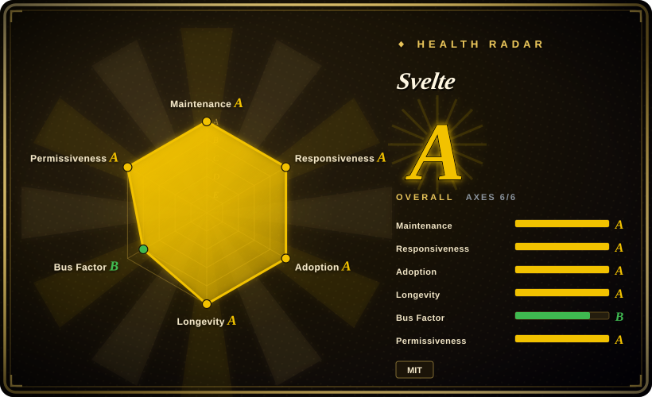

# Svelte

A compile-time frontend framework that transforms components into efficient vanilla JavaScript at build time, eliminating virtual DOM overhead for smaller bundles and faster runtime performance.

## When to use

You're a small-to-medium team building a web application where performance and bundle size matter. You evaluate React, but its virtual DOM and runtime overhead mean your initial JavaScript payload is larger than you'd like, especially for users on slower networks. You evaluate Vue, but you want something even leaner and more readable. You choose Svelte because its compiler turns your components into plain JavaScript that updates the DOM directly — no virtual DOM diffing, no runtime framework weight. Your `.svelte` files look like enhanced HTML with JavaScript and CSS scoped by default, making onboarding straightforward for developers who know the web platform. You ship faster, your app feels snappier, and you don't need to learn a complex reactive API because the compiler handles reactivity for you.

## When NOT to use

- **If you need the largest possible ecosystem and third-party library selection, use React instead of Svelte, because** React's ecosystem is an order of magnitude larger. For every niche UI need, a React library exists; with Svelte you will often build components yourself or wrap React libraries via compatibility layers.
- **If you need to hire frontend developers quickly and cheaply, use React or Vue instead of Svelte, because** the Svelte talent pool is significantly smaller. In most job markets, finding experienced Svelte developers is harder than finding React or Vue developers.
- **If you need a mature meta-framework with deep SSR/SSG and hosting integration, use Next.js or Nuxt instead of Svelte, because** while SvelteKit exists and is improving, its ecosystem and hosting integrations are smaller than Next.js's. If your team already runs on Vercel, Next.js has deeper first-class support.
- **If you are risk-averse about framework paradigm shifts, use Vue or React instead of Svelte, because** Svelte 5 introduced runes, a significant departure from Svelte 4's label-based reactivity. This caused community friction and means existing Svelte 4 code requires migration effort.
- **If you need deep enterprise tooling, built-in dependency injection, and strict architectural opinions, use Angular instead of Svelte, because** Svelte is intentionally unopinionated and lightweight. It does not ship with a CLI-scaffolded module system, form validation, or HTTP client out of the box.
- **If you need to mix this framework into an existing large React or Vue codebase incrementally, use React or Vue instead of Svelte, because** while Svelte can be embedded, the tooling and community patterns for gradual migration are less mature than React's or Vue's.

## Comparison

| Alternative | In index | Our verdict | Tradeoff |
| --- | --- | --- | --- |
| React | 未收录 | The dominant UI library with the largest ecosystem and job market. | React has vastly more libraries and a larger hiring pool; Svelte is faster and simpler for small-to-medium apps with smaller bundles. |
| Vue.js | 未收录 | Progressive framework with a gentle learning curve and strong ecosystem. | Vue is easier to hire for and has more third-party integrations; Svelte compiles to smaller bundles and has less runtime overhead. |
| [Angular](angular.md) | ✅ | Enterprise-grade, opinionated framework with deep TypeScript integration. | Angular ships everything built-in for large teams; Svelte is lighter and faster but lacks enterprise tooling depth and CLI scaffolding. |
| Next.js | 未收录 | Full-stack React framework with best-in-class SSR/SSG and Vercel integration. | Next.js dominates the React meta-framework space; SvelteKit is the Svelte equivalent but has a smaller ecosystem and fewer integrations. |
| SvelteKit | 未收录 | The official meta-framework built on Svelte (like Next.js for React). | SvelteKit is the natural pairing for full-stack Svelte; use Svelte alone only when you do not need SSR, routing, or a backend. |
| Solid.js | 未收录 | Fine-grained reactive UI library with no virtual DOM and excellent performance. | Solid is even more performance-focused with a smaller community; Svelte has a larger ecosystem, SvelteKit, and a gentler learning curve. |

## Tech stack

- **TypeScript** — primary implementation language; Svelte has first-class TS support
- **Compiler-based** — no virtual DOM; the compiler transforms `.svelte` files into efficient vanilla JavaScript at build time
- **Runes (Svelte 5)** — fine-grained explicit reactivity system using `$state`, `$derived`, `$effect`, etc.
- **Vite** — the default and recommended build tooling (SvelteKit is built on Vite)
- **CSS scoping** — styles are component-scoped by default without additional configuration
- **SvelteKit** — optional meta-framework adding routing, SSR, server endpoints, and adapters for deployment targets

## Dependencies

- **Node.js** — for the compiler, build tools, and SvelteKit (LTS recommended)
- **A modern browser** — Svelte compiles to evergreen JavaScript; no runtime framework to load
- **Optional: SvelteKit** — for SSR, file-system routing, API endpoints, and static site generation
- **Optional: TypeScript** — fully supported but optional; plain JavaScript works fine
- **Build tools**: Vite is the default; Rollup or Webpack can be configured for custom setups

## Ops difficulty

**Low**. Svelte apps compile to static JavaScript that deploys to any CDN or static host. The compiler and Vite handle the build pipeline. Complexity arises when:
- You need SSR and run SvelteKit, which requires a Node.js server or an edge runtime (e.g., Vercel, Cloudflare Workers)
- You upgrade from Svelte 4 to Svelte 5, which requires rewriting reactive logic from `$:` labels to runes
- You need custom compiler plugins or preprocessors (e.g., for Pug, Sass, or custom transformations)
- You embed Svelte components into a non-Svelte application and must manage build boundaries

## Health & viability

- **Maintenance**: Active — Svelte 5 was released in late 2024, and the core team continues regular releases. The compiler and SvelteKit are under continuous development.
- **Governance**: Creator-led by Rich Harris, now employed at Vercel. Bus factor is moderate — the community is passionate but concentrated around a small core team. The governance model is benevolent-dictator-style rather than foundation-driven.
- **Backing & longevity**: Vercel employs Rich Harris and funds Svelte development. This is a strong backing signal, though Vercel also owns Next.js, creating a dual-framework dynamic where resource allocation is not transparent. [推断] The project's ~8-year age × still-active gives a moderate Lindy signal — it is established but not as old as React or Angular.
- **Adoption & ecosystem**: Growing steadily but an order of magnitude smaller than React. Notable production users include The New York Times and Apple (in some products). SvelteKit is maturing but has fewer third-party integrations than Next.js or Nuxt. Documentation quality is high.
- **Risk flags**: Svelte 5's runes introduced a significant paradigm shift from Svelte 4's `$:` labels, causing real migration friction for existing codebases. No relicense history (MIT remains stable). No notable CVEs. The smaller ecosystem means fewer battle-tested third-party solutions.

## Caveats (unverified)

- [未验证] The exact bundle size reduction compared to React or Vue varies by application and build optimization configuration.
- [推断] The relative size of the Svelte developer job market compared to React is inferred from job postings and community surveys, not hard data.
- [未验证] The precise proportion of production deployments using SvelteKit versus standalone Svelte has not been independently verified.
- [未验证] The extent of Apple and The New York Times's production Svelte usage is based on public case studies and conference talks, not independent audits.
- [推断] The actual community friction and migration effort from Svelte 4 to Svelte 5 runes is based on developer reports and social media sentiment, not measured data.
