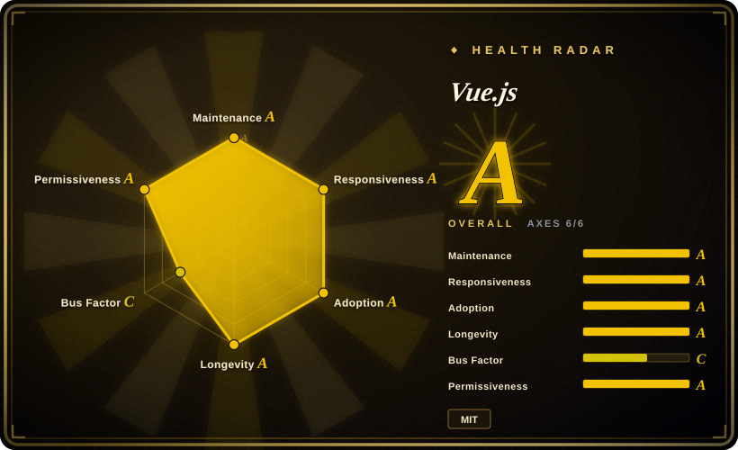

# Vue.js

A progressive JavaScript framework for building user interfaces, created by Evan You. Known for its gentle learning curve, excellent documentation, and incrementally adoptable architecture.

## When to use

You're a frontend developer or a small team building a modern web application — from a lightweight dashboard to a medium-complexity SPA. You've tried React, but the ecosystem's "bring your own everything" philosophy means spending days choosing and configuring state management, routing, and build tools. You want something that works out of the box but doesn't lock you into an opinionated enterprise structure. You pick Vue.js because its single-file components (`.vue`) let you colocate template, logic, and styles naturally; the Options API gets you productive in hours, and the Composition API (Vue 3) scales cleanly as your codebase grows. You need a framework that can start as a simple drop-in script and evolve into a full SPA with Vue Router and Pinia — or even SSR via Nuxt.js — without throwing away your early work. You also value documentation that reads like a well-maintained book, not a scattered wiki.

## When NOT to use

- **If you need the largest possible job market and hiring pool, use React instead of Vue.js, because** Vue's market share is smaller than React's in most Western job markets, which can make hiring harder at scale.
- **If you need a heavily opinionated, batteries-included enterprise framework with strict architectural guardrails, use Angular instead of Vue.js, because** Vue is intentionally flexible and unopinionated. Teams that need enforced patterns (DI, strict module boundaries, prescribed project structure) may find Vue's freedom becomes chaos without strong internal conventions.
- **If you need best-in-class SSR/SSG without extra framework layering, use Next.js or Nuxt.js instead of plain Vue.js, because** Vue itself is a client-side framework; SSR requires Nuxt.js (a meta-framework), adding another abstraction layer.
- **If you are already deep in the React ecosystem (Next.js, React Native, extensive custom hooks), switching to Vue.js introduces friction, because** the mental models differ (Options API vs hooks, template vs JSX, Vue's Proxy reactivity vs React's explicit state), and ecosystem tools (devtools, testing libraries, UI component libraries) are more mature for React.
- **If your team recently migrated from Vue 2 to Vue 3 and the ecosystem wounds are still fresh, consider React or Svelte for new greenfield projects, because** the Vue 2→3 transition was disruptive: breaking changes, ecosystem lag, and some third-party libraries never migrated. [推断]
- **If you need a framework backed by a mega-corporation with guaranteed long-term funding, use React (Meta) or Angular (Google) instead of Vue.js, because** Vue is primarily driven by Evan You and community sponsors, not a corporate behemoth. [推断]

## Comparison

| Alternative | In index | Our verdict | Tradeoff |
| --- | --- | --- | --- |
| [React](react.md) | ✅ | Choose React when you want the largest UI library ecosystem and a "just JavaScript" philosophy. | React has a larger job market and more third-party libraries; Vue is easier to learn and has a more integrated experience. |
| [Angular](angular.md) | ✅ | A comprehensive, opinionated TypeScript framework for enterprise-scale apps. | Angular ships with more built-in structure (DI, CLI, forms); Vue is lighter, more flexible, and faster to prototype. |
| [Svelte](svelte.md) | ✅ | Choose Svelte when you want a compile-time framework with minimal runtime and no virtual DOM. | Svelte is smaller and faster for simple apps; Vue has a larger ecosystem, more mature tooling, and a gentler migration path. |
| SvelteKit | 未收录 | Choose SvelteKit when you want Svelte's full-stack meta-framework rather than Vue's progressive app framework. | SvelteKit adds routing, SSR, and app conventions around Svelte; Vue's equivalent is Nuxt.js, while Vue alone is easier to adopt incrementally. |
| [Next.js](nextjs.md) | ✅ | Choose Next.js when your SSR/SEO requirement sits in the React ecosystem rather than Vue. | Next.js is the React default for SSR/SEO; Vue's equivalent is Nuxt.js, which has a smaller community footprint. |
| Nuxt.js | 未收录 | The meta-framework for Vue — SSR, SSG, file-based routing, and auto-imports. | Nuxt adds SSR/SSG to Vue; it is the Vue answer to Next.js but with less market share and third-party integration. |

## Tech stack

- **TypeScript** — Vue 3 core is written in TypeScript; first-class TS support for user code
- **JavaScript** — the framework runs in the browser; no compile target restrictions beyond ES2015+
- **Proxy-based reactivity** — Vue 3 uses native ES6 Proxies for fine-grained reactivity (Vue 2 used `Object.defineProperty`)
- **Virtual DOM** — a lightweight VDOM diffing layer for rendering updates
- **Single-file components (`.vue`)** — colocated template, `<script>`, and `<style>` blocks compiled at build time
- **Vite** — the recommended build tool and dev server (created by the same author; Vue CLI is legacy)
- **Vue Router** — official client-side routing library
- **Pinia** — official state management (successor to Vuex)
- **Nuxt.js** — meta-framework for SSR, SSG, and file-based routing (separate repo, but part of the ecosystem)

## Dependencies

- **Node.js** — for build tooling (Vite, Vue compiler); LTS recommended
- **A modern browser** — Vue 3 requires ES2015+ (no IE11 support); Vue 2 still exists for legacy but is EOL
- **Optional: Nuxt.js** — if you need SSR or SSG
- **Optional: Vue Router** — if you need client-side routing (required for SPAs)
- **Optional: Pinia** — if you need centralized state management beyond component-local reactivity
- **Build tools**: Vite is recommended; Webpack is still supported via `@vue/cli` (legacy) or manual config

## Ops difficulty

**Low**. Vue apps are static SPAs that deploy to any CDN or static host. The build pipeline is handled by Vite (fast, minimal config). Complexity arises when:
- You enable SSR via Nuxt.js, which requires a Node.js server and more deployment coordination
- You manage complex state across many micro-frontends (Vue's flexibility becomes a liability without conventions)
- You maintain a legacy Vue 2 codebase alongside Vue 3 (dual-version support is a real burden)

## Health & viability

- **Maintenance**: Active — Vue 3 is in stable v3.5.x with regular releases; the core team is responsive and the commit cadence is healthy. [推断]
- **Governance / bus factor**: Moderate concern — Vue is led primarily by Evan You, with a small core team and community sponsors. This is less distributed than React (Meta) or Angular (Google), but the project has proven resilient over 10+ years. [推断]
- **Backing & longevity**: No mega-corporate backing — Vue survives on sponsorships (Open Collective, corporate sponsors like Vercel, Alibaba, Baidu). The Lindy prior is strong: 10+ years old and still actively maintained, which is a safer signal than a 2-year-old hype project. [推断]
- **Adoption & ecosystem**: Very strong in China and Asia-Pacific; growing in the West. The ecosystem (Vue Router, Pinia, Nuxt, Vuetify, Element Plus) is mature and well-documented. [推断]
- **Risk flags**: No relicense history (MIT throughout). The Vue 2→3 migration was a notable disruption — some third-party libraries never migrated, and teams had to absorb breaking changes. Future major migrations should be watched carefully. [推断]

## Caveats (unverified)

- [推断] Vue's exact market share in new project starts vs React is inferred from job postings and Stack Overflow surveys, not independently audited.
- [推断] The proportion of Vue production usage that is Vue 2 vs Vue 3 is not publicly known; many enterprises may still be on Vue 2.
- [推断] The exact level of corporate sponsorship funding and its stability year-over-year has not been independently verified.
- [未验证] Whether Vue's reactivity system (Proxies) causes debugging friction in complex nested state scenarios compared to React's explicit model is debated but not measured.
- [推断] The strength of Vue's community in Western markets vs Asia-Pacific is based on anecdotal conference attendance and GitHub geo data, not rigorous surveys.
