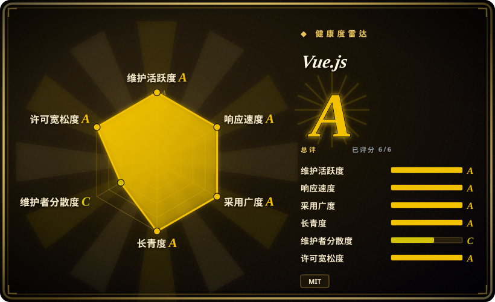

# Vue.js

由 Evan You 创建的渐进式 JavaScript 用户界面框架，以温和的学习曲线、优秀的文档和可增量采纳的架构著称。

## 何时使用

你是一名前端开发者或一个小团队，正在构建一个现代 Web 应用——从轻量级仪表盘到中等复杂度的 SPA。你试过 React，但它的生态「自带一切」的哲学意味着你要花数天选择和配置状态管理、路由和构建工具。你想要一个开箱即用但不会被 opinionated 企业结构锁定的框架。你选择 Vue.js，因为它的单文件组件（`.vue`）让你自然地并列模板、逻辑和样式；Options API 让你在几小时内就能上手，而 Composition API（Vue 3）能随着代码库增长而优雅扩展。你需要一个能从简单 drop-in 脚本起步、逐步进化成带 Vue Router 和 Pinia 的完整 SPA——甚至通过 Nuxt.js 实现 SSR——而不需要丢弃早期工作的框架。你也重视那些读起来像精心维护的书籍而非散落 wiki 的文档。

## 何时不用

- **如果你需要最大的就业市场和招聘池，请用 React 而不是 Vue.js，因为** Vue 在大多数西方就业市场的份额小于 React，大规模招聘可能更难。
- **如果你需要重度 opinionated、电池全包的企业级框架，带严格的架构护栏，请用 Angular 而不是 Vue.js，因为** Vue 有意保持灵活和不 opinionated。需要强制模式（依赖注入、严格模块边界、规定项目结构）的团队可能会发现 Vue 的自由在缺乏强内部规范时会变成混乱。
- **如果你需要一流的 SSR/SSG 而不需要额外的框架层，请用 Next.js 或 Nuxt.js 而不是纯 Vue.js，因为** Vue 本身是一个客户端框架；SSR 需要 Nuxt.js（元框架），增加了一层抽象。
- **如果你已经深度沉浸在 React 生态（Next.js、React Native、大量自定义 hooks），切换到 Vue.js 会引入摩擦，因为** 心智模型不同（Options API vs hooks，template vs JSX，Vue 的 Proxy 响应式 vs React 的显式状态），且生态工具（devtools、测试库、UI 组件库）对 React 更成熟。
- **如果你的团队刚从 Vue 2 迁移到 Vue 3 且生态创伤仍新鲜，在新绿地项目中考虑 React 或 Svelte，因为** Vue 2→3 的过渡是破坏性的：破坏性变更、生态滞后、部分第三方库从未迁移。[推断]
- **如果你需要由巨型公司背书、保证长期资金的框架，请用 React（Meta）或 Angular（Google）而不是 Vue.js，因为** Vue 主要由 Evan You 和社区赞助者驱动，而非企业巨头。[推断]

## 横向对比

| 替代品 | 是否收录 | 我们的评价 | 取舍 |
| --- | --- | --- | --- |
| React | 未收录 | 最流行的 UI 库，生态庞大，秉承「就是 JavaScript」的理念。 | React 就业市场更大，第三方库更多；Vue 更易学，体验更一体化。 |
| [Angular](angular.zh.md) | ✅ | 全面的、opinionated 的 TypeScript 框架，用于企业级应用。 | Angular 自带更多内置结构（依赖注入、CLI、表单）；Vue 更轻、更灵活、原型验证更快。 |
| Svelte / SvelteKit | 未收录 | 编译时框架，运行时开销极小，没有虚拟 DOM。 | Svelte 对简单应用更小更快；Vue 生态更大、工具更成熟、迁移路径更温和。 |
| Next.js | 未收录 | 全栈 React 框架，SSR/SSG 一流，与 Vercel 深度集成。 | Next.js 是 React 生态 SSR/SEO 的默认选择；Vue 的对应方案是 Nuxt.js，社区规模更小。 |
| Nuxt.js | 未收录 | Vue 的元框架——SSR、SSG、基于文件的路由和自动导入。 | Nuxt 为 Vue 增加 SSR/SSG；它是 Vue 对 Next.js 的回答，但市场份额和第三方集成更少。 |

## 技术栈

- **TypeScript** —— Vue 3 核心用 TypeScript 编写；用户代码享有一流 TS 支持
- **JavaScript** —— 框架在浏览器中运行；编译目标仅需 ES2015+
- **基于 Proxy 的响应式** —— Vue 3 使用原生 ES6 Proxy 实现细粒度响应式（Vue 2 使用 `Object.defineProperty`）
- **虚拟 DOM** —— 轻量级 VDOM 差分层，用于渲染更新
- **单文件组件（`.vue`）** —— 模板、`<script>` 和 `<style>` 块在构建时编译
- **Vite** —— 推荐的构建工具和开发服务器（由同一作者创建；Vue CLI 已 legacy）
- **Vue Router** —— 官方客户端路由库
- **Pinia** —— 官方状态管理（Vuex 的继任者）
- **Nuxt.js** —— 用于 SSR、SSG 和基于文件的路由的元框架（独立仓库，但属于生态一部分）

## 依赖

- **Node.js** —— 构建工具所需（Vite、Vue 编译器）；建议 LTS
- **现代浏览器** —— Vue 3 需要 ES2015+（不支持 IE11）；Vue 2 仍存在但已 EOL
- **可选：Nuxt.js** —— 如需 SSR 或 SSG
- **可选：Vue Router** —— 如需客户端路由（SPA 必需）
- **可选：Pinia** —— 如需超越组件本地响应式的集中状态管理
- **构建工具**：推荐 Vite；Webpack 仍可通过 `@vue/cli`（legacy）或手动配置支持

## 运维难度

**低**。Vue 应用是静态 SPA，可部署到任何 CDN 或静态托管。构建管线由 Vite 处理（快速、最小配置）。复杂度来自：
- 通过 Nuxt.js 启用 SSR，需要 Node.js 服务器和更多部署协调
- 在多个微前端之间管理复杂状态（缺乏规范时 Vue 的灵活性会变成负担）
- 同时维护 Vue 2 遗留代码库和 Vue 3（双版本支持是真实负担）

## 健康度与可持续性

- **维护活跃度**：活跃——Vue 3 处于稳定的 v3.5.x，定期发布；核心团队响应及时，提交节奏健康。
- **治理/巴士系数**：中等担忧——Vue 主要由 Evan You 领导，核心团队较小，靠社区赞助。这比 React（Meta）或 Angular（Google）更分散，但项目已证明在 10 多年中保持韧性。
- **背书与长青度**：无 mega-corporate 背书——Vue 靠赞助（Open Collective、Vercel、阿里巴巴、百度等企业赞助）生存。Lindy 先验很强：10 年以上历史且仍活跃维护，这比 2 年炒作项目更安全。
- **采用广度与生态**：在中国和亚太地区非常强；在西方稳步增长。生态（Vue Router、Pinia、Nuxt、Vuetify、Element Plus）成熟且文档完善。
- **风险信号**：无重新许可历史（始终 MIT）。Vue 2→3 迁移是显著干扰——部分第三方库从未迁移，团队不得不吸收破坏性变更。未来的重大迁移应被密切关注。

## 存疑（未验证）

- [推断] Vue 在新项目启动中相对于 React 的确切市场份额是从职位发布和 Stack Overflow 调查推断的，未经独立审计。
- [推断] Vue 生产使用中 Vue 2 与 Vue 3 的比例未知；许多企业可能仍在使用 Vue 2。
- [推断] 企业赞助资金的确切水平和年度稳定性未经独立核实。
- [未验证] Vue 的响应式系统（Proxy）在复杂嵌套状态场景中是否比 React 的显式模型造成更多调试摩擦，存在争议但未被测量。
- [推断] Vue 在西方市场与亚太地区的社区强度基于会议出席和 GitHub 地理数据的轶事，而非严格调查。
