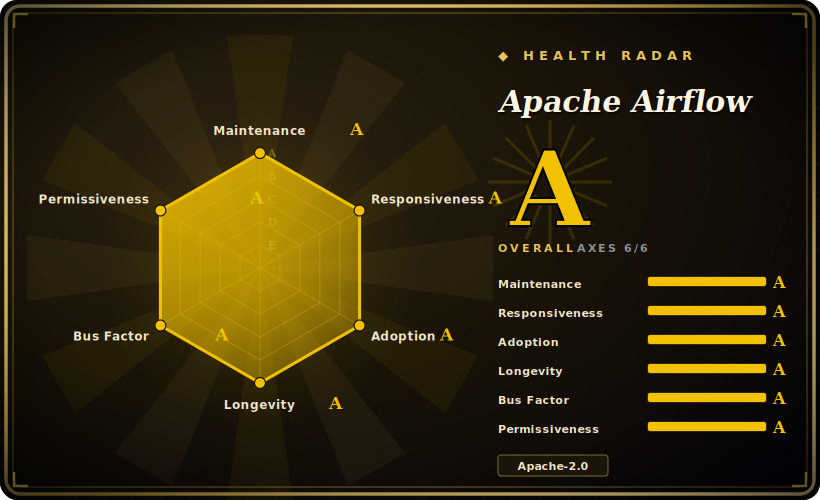

# Apache Airflow

A platform to programmatically author, schedule, and monitor batch data workflows as Python DAGs — a scheduler, a metadata database, a web UI, and a pluggable executor, with a large catalog of operators and provider integrations.

## When to use

You're a data engineer responsible for a fleet of scheduled batch pipelines — nightly ELT into a warehouse, hourly aggregations, a daily training-data refresh, a few cross-system jobs that pull from S3, run a Spark step, and load Snowflake. The work is *time- or interval-driven*, every job is a graph of dependent steps, and you need retries, backfills, alerting on failure, and one place to see what ran, what's late, and what broke. You write each pipeline as a Python file that builds a DAG: tasks are operators (Bash, Python, SQL, a Spark submit, a Kubernetes pod), edges are dependencies, and a `schedule` controls cadence. Airflow's scheduler walks the DAGs, hands ready tasks to an executor (local, Celery, or Kubernetes), records every run in the metadata DB, and renders the grid/graph views in the web UI so you can inspect, re-run, or backfill a date range from the browser.

You reach for it specifically when you want pipelines as code in version control, a huge library of pre-built operators and provider packages (cloud SDKs, databases, transfer operators) instead of hand-rolled glue, and a mature operational surface — SLAs, retries with backoff, task-level logs, and a UI your whole team already knows. It's the default orchestration layer when the unit of work is "a scheduled batch job made of steps," and you'd rather configure proven operators than build a scheduler yourself.

## When NOT to use

- **Low-latency streaming or event-driven work.** Airflow is a *batch scheduler*, not a stream processor or a message-driven runtime. For continuous streams use Flink/Spark Streaming/Kafka consumers; for "fire on this event within milliseconds" it's the wrong tool.
- **Sub-minute or per-request workflows.** The scheduler loop, DAG parsing, and task startup overhead make Airflow a poor fit for sub-minute cadence or request/response-style orchestration where each invocation must return quickly.
- **You want a light, single-service deploy.** Airflow is a multi-service system — scheduler + metadata DB + web server + workers (and a message broker for the Celery executor). Standing that up and keeping it healthy is real operational weight; a cron + script or a managed function may be enough at small scale.
- **Highly dynamic or data-aware pipelines.** If your graph shape depends heavily on runtime data, or you want first-class data assets, typing, and local-dev ergonomics, newer tools like Dagster (asset-oriented) or Prefect (Pythonic, dynamic) often feel more modern. Airflow has added data-aware scheduling, but its DAG-as-static-structure heritage shows. [推断]
- **Steep learning curve for the team.** Operators, executors, connections, XComs, scheduling semantics, and the metadata DB are a lot to learn and operate; for a couple of simple jobs the ramp may not pay off.
- **Long-running, stateful, human-in-the-loop orchestration.** For durable execution with arbitrary code, signals, and long waits (sagas, approval flows), a workflow engine like Temporal fits better than a batch DAG scheduler.

## Comparison

| Alternative | In index | Our verdict | Tradeoff |
|---|---|---|---|
| Prefect | 未收录 | Use this page for its stated niche; choose Prefect when you need pythonic, dynamic flows with lighter local-dev ergonomics and a hybrid/managed control plane. | Pythonic, dynamic flows with lighter local-dev ergonomics and a hybrid/managed control plane; smaller operator ecosystem and a different (flow/task) model than Airflow's DAG files. |
| Dagster | 未收录 | Use this page for its stated niche; choose Dagster when you need asset-oriented orchestration with typing, data lineage, and strong local testing. | Asset-oriented orchestration with typing, data lineage, and strong local testing; more opinionated and newer, with a smaller integration catalog than Airflow's providers. |
| Argo Workflows | 未收录 | Use this page for its stated niche; choose Argo Workflows when you need kubernetes-native, container-step DAGs defined in YAML/CRDs. | Kubernetes-native, container-step DAGs defined in YAML/CRDs; great if everything already runs as pods, but no rich Python operator library and a thinner data-engineering UX. |
| Temporal | 未收录 | Use this page for its stated niche; choose Temporal when you need durable-execution engine for long-running, stateful, code-driven workflows (signals, retries, timers. | Durable-execution engine for long-running, stateful, code-driven workflows (signals, retries, timers); not a batch *scheduler* with a DAG UI — a different orchestration shape entirely. |
| Luigi | 未收录 | Use this page for its stated niche; choose Luigi when you need spotify's older Python pipeline library. | Spotify's older Python pipeline library; lighter and simpler, but largely superseded by Airflow with a much smaller community and weaker scheduling/UI. |

## Tech stack

- **Language:** Python — DAGs and operators are Python; the core scheduler/web server are Python services.
- **Web/UI:** a web server rendering DAG grid/graph views, logs, and run history; built on a Python web stack with a REST API. [未验证]
- **Scheduler + executors:** a scheduler process plus a pluggable executor — Local, Celery (distributed workers), or Kubernetes (one pod per task) — selected by deployment scale.
- **Operators & providers:** a large catalog of built-in operators and separately versioned *provider* packages for clouds, databases, and transfer/SQL/Spark/etc. integrations.
- **Persistence:** a metadata database (PostgreSQL or MySQL in production; SQLite only for local dev) holds DAG runs, task state, connections, and variables.

## Dependencies

- **Metadata DB (required):** a relational database — PostgreSQL or MySQL for any real deployment (SQLite is local-dev only). This is the system of record; its availability and backups are load-bearing.
- **Executor / workers:** Local executor needs nothing extra; Celery executor needs a pool of worker processes; Kubernetes executor needs a Kubernetes cluster to schedule task pods into.
- **Message broker (Celery only):** the Celery executor needs a broker (e.g. Redis or RabbitMQ) to dispatch tasks to workers. [未验证]
- **Provider packages:** the specific clouds/DBs/tools your DAGs touch require their provider packages and credentials/connections configured.
- **Install paths:** PyPI packages and official container images are published; production deploys commonly use the Helm chart or a managed Airflow service.

## Ops difficulty

**Medium-to-high.** A single-machine LocalExecutor with a Postgres backend is approachable, but production Airflow is a distributed system you own: scheduler (and its parsing/loop health), web server, a relational metadata DB to size and back up, and a worker fleet — plus a broker if you run Celery, or a Kubernetes cluster if you run the K8s executor. Real operational work includes DAG-parse performance and scheduler tuning, database growth/cleanup, executor capacity and queue management, upgrades across the core plus dozens of provider packages, and chasing task failures down to the external service each operator talks to. Managed offerings exist if you'd rather not run the control plane yourself. The scheduling model and metadata DB are the hard parts; individual tasks are usually the easy part.

## Health & viability

- **Maintenance (2026-06)** — last pushed 2026-06, not archived, on the active v3.x line; one of the busiest data-infra repos, so clearly **active**, not coasting. The ~1.7k open issues read as scale-of-traffic, not neglect. `[推断]`
- **Governance & bus factor** — an **Apache Software Foundation** top-level project (`Organization`-owned under `apache/`): foundation governance with a PMC and many corporate contributors is about the strongest bus-factor profile open source offers — no single vendor owns the roadmap. `[推断]`
- **Age & Lindy** — created ~2015-04, so ~11 years old (2026-06) and still actively developed: a **strong-Lindy** bet (long-lived *and* active), and the default orchestration layer much of data engineering already runs on. `[推断]`
- **Adoption & ecosystem** — huge production footprint, a large operator/provider catalog, managed offerings from multiple clouds, and ~46k stars; ecosystem depth is a real moat, not hype. `[未验证]`
- **Risk flags** — Apache-2.0 under ASF (no relicense/open-core risk — foundation IP policy precludes a vendor rug-pull); the real cost is **operational weight** (multi-service distributed system), not licensing or abandonment. `[未验证]`

## Caveats (unverified)

- [未验证] ~46k GitHub stars and "active (2026-06)" come from the repo page; star counts are date-sensitive and unreliable — treat as indicative only.
- [未验证] The exact current stable version of the 3.x line and its release date were not pinned here; verify against the repo's releases before relying on a specific version.
- [未验证] Web-UI internals (framework, REST API surface) and the precise supported database/Python version ranges change across releases — confirm in the docs for your target version.
- [推断] The "Dagster/Prefect feel more modern for dynamic/data-aware DAGs" judgment is an opinion about tooling ergonomics, not a measured benchmark; Airflow has added data-aware scheduling that narrows the gap.
- [推断] The Celery broker requirement (Redis/RabbitMQ) follows from standard Celery deployment; the specific broker is a deployment choice, not fixed by Airflow.
