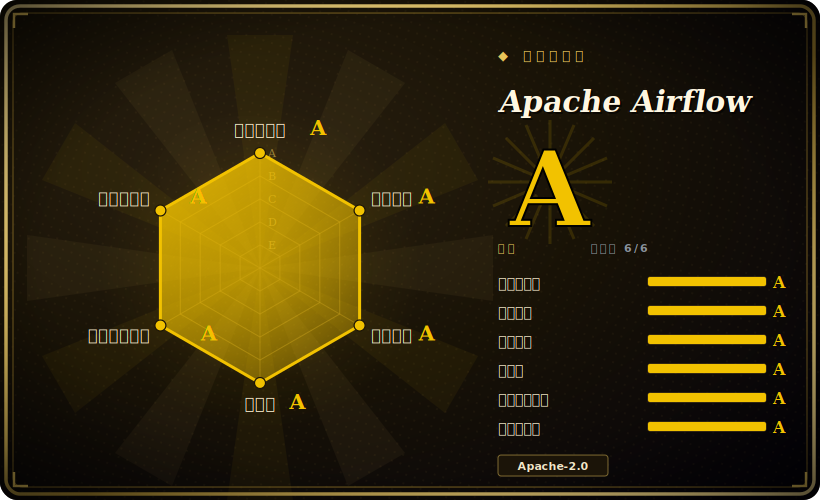

# Apache Airflow

一个用代码编排、调度并监控批处理数据工作流的平台——把流水线写成 Python DAG，由调度器、元数据库、Web UI 和可插拔执行器组成，并带有庞大的 operator 与 provider 集成目录。

## 何时使用

你是数据工程师，负责一片定时跑的批处理流水线——每晚往数仓做 ELT、按小时做聚合、每天刷新一批训练数据，还有几个跨系统作业要从 S3 拉数据、跑一个 Spark 步骤、再灌进 Snowflake。这些活都是*按时间或按间隔触发*的，每个作业是一张由依赖步骤组成的图，你需要重试、回填、失败告警，以及一个统一的地方来看：什么跑了、什么迟了、什么挂了。你把每条流水线写成一个 Python 文件来构建 DAG：任务是 operator（Bash、Python、SQL、一次 Spark 提交、一个 Kubernetes pod），边是依赖，`schedule` 控制节奏。Airflow 的调度器遍历这些 DAG，把就绪任务交给执行器（Local、Celery 或 Kubernetes），把每次运行记进元数据库，并在 Web UI 里渲染 grid/graph 视图，让你在浏览器里检查、重跑或回填某个日期区间。

当你想要流水线即代码、进版本库，想用一大套现成的 operator 和 provider 包（云 SDK、数据库、传输 operator）而不是手写胶水，并且想要成熟的运维面——SLA、带退避的重试、任务级日志、团队早已熟悉的 UI——时，你会专门选它。当工作单元是「由若干步骤组成的定时批处理作业」时，它就是默认的编排层：你宁愿配置久经考验的 operator，也不想自己造一个调度器。

## 何时不用

- **低延迟流式或事件驱动的活。** Airflow 是*批处理调度器*，不是流处理器，也不是消息驱动运行时。连续流请用 Flink/Spark Streaming/Kafka consumer；要「毫秒级响应某个事件」它就是错的工具。
- **分钟级以下或按请求触发的工作流。** 调度器循环、DAG 解析和任务启动开销，让 Airflow 不适合分钟级以下的节奏，也不适合每次调用都要快速返回的请求/响应式编排。
- **你想要轻量的单服务部署。** Airflow 是多服务系统——调度器 + 元数据库 + Web server + worker（用 Celery 执行器时还要一个消息 broker）。把这套搭起来并维持健康是实打实的运维重量；小规模下一个 cron + 脚本或一个托管函数可能就够了。
- **高度动态或数据感知的流水线。** 如果你的图形状严重依赖运行时数据，或你想要一等公民的数据资产、类型和本地开发体验，Dagster（面向资产）或 Prefect（Pythonic、动态）这类更新的工具往往更现代。Airflow 已经加了数据感知调度，但它「DAG 即静态结构」的出身仍会露出来。[推断]
- **团队学习曲线陡。** operator、执行器、connection、XCom、调度语义和元数据库，要学要运维的东西不少；只为几个简单作业，这个爬坡未必划算。
- **长时运行、有状态、需人工介入的编排。** 要做带任意代码、信号和长等待的持久化执行（saga、审批流），Temporal 这类工作流引擎比批处理 DAG 调度器更合适。

## 横向对比

| 替代品 | 是否收录 | 取舍 |
|---|---|---|
| Prefect | 未收录 | Pythonic、动态的 flow，本地开发体验更轻，带混合/托管控制面；operator 生态更小，模型（flow/task）也与 Airflow 的 DAG 文件不同。 |
| Dagster | 未收录 | 面向资产的编排，带类型、数据血缘和强本地测试；更有主见也更新，集成目录比 Airflow 的 provider 小。 |
| Argo Workflows | 未收录 | Kubernetes 原生、用 YAML/CRD 定义容器步骤 DAG；如果一切本就跑在 pod 上很合适，但没有丰富的 Python operator 库，数据工程 UX 也更薄。 |
| Temporal | 未收录 | 面向长时运行、有状态、代码驱动工作流（信号、重试、定时器）的持久化执行引擎；不是带 DAG UI 的批处理*调度器*——是完全不同的编排形态。 |
| Luigi | 未收录 | Spotify 早期的 Python 流水线库；更轻更简单，但基本已被 Airflow 取代，社区小得多、调度/UI 也更弱。 |

## 技术栈

- **语言：** Python——DAG 和 operator 都是 Python；核心调度器/Web server 也是 Python 服务。
- **Web/UI：** 一个 Web server，渲染 DAG 的 grid/graph 视图、日志和运行历史；基于 Python web 栈，带 REST API。[未验证]
- **调度器 + 执行器：** 一个调度器进程，外加可插拔执行器——Local、Celery（分布式 worker）或 Kubernetes（每任务一个 pod）——按部署规模选用。
- **operator 与 provider：** 一大套内置 operator，加上单独版本化的 *provider* 包，覆盖云、数据库以及 transfer/SQL/Spark 等集成。
- **持久化：** 一个元数据库（生产用 PostgreSQL 或 MySQL；SQLite 仅限本地开发）保存 DAG run、任务状态、connection 和 variable。

## 依赖

- **元数据库（必需）：** 一个关系型数据库——任何真实部署都用 PostgreSQL 或 MySQL（SQLite 只限本地开发）。它是系统的记录源，其可用性与备份至关重要。
- **执行器 / worker：** Local 执行器不需要额外东西；Celery 执行器需要一池 worker 进程；Kubernetes 执行器需要一个 Kubernetes 集群来调度任务 pod。
- **消息 broker（仅 Celery）：** Celery 执行器需要一个 broker（如 Redis 或 RabbitMQ）把任务派发给 worker。[未验证]
- **provider 包：** 你的 DAG 接触的具体云/数据库/工具，需要装对应 provider 包并配好凭据/connection。
- **安装路径：** 官方发布 PyPI 包和容器镜像；生产部署常用 Helm chart 或托管 Airflow 服务。

## 运维难度

**中到高。** 单机 LocalExecutor 配一个 Postgres 后端还算好上手，但生产 Airflow 是你自己运维的分布式系统：调度器（及其解析/循环健康）、Web server、一个要规划容量和备份的关系型元数据库，外加一片 worker——用 Celery 还要 broker，用 K8s 执行器还要一个 Kubernetes 集群来调度任务 pod。真正的运维活包括：DAG 解析性能与调度器调优、数据库膨胀与清理、执行器容量与队列管理、核心加上几十个 provider 包的升级，以及把任务失败一路追到每个 operator 实际连的外部服务。如果不想自己跑控制面，也有托管方案。调度模型和元数据库是难的部分；单个任务通常才是容易的部分。

## 健康度与可持续性

- **维护（2026-06）** —— 最近推送在 2026-06，未归档，处于活跃的 v3.x 线；是数据基础设施里最繁忙的仓库之一，显然**活跃**而非停滞滑行。约 1.7k 个 open issue 反映的是流量规模，而非疏于维护。`[推断]`
- **治理与 bus factor** —— 一个 **Apache 软件基金会**顶级项目（在 `apache/` 下、`Organization` 所有）：带 PMC 和众多企业贡献者的基金会治理，是开源能提供的最强 bus-factor 画像之一——没有单一厂商掌控路线图。`[推断]`
- **年龄与 Lindy** —— 约 2015-04 创建，到 2026-06 约 11 岁且仍在积极开发：一个**强 Lindy**下注（既长寿*又*活跃），也是大量数据工程已经在跑的默认编排层。`[推断]`
- **采用与生态** —— 巨大的生产装机量、庞大的 operator/provider 目录、多家云厂商的托管方案，约 46k star；生态深度是真正的护城河，而非炒作。`[未验证]`
- **风险标记** —— ASF 下的 Apache-2.0（无 relicense / open-core 风险——基金会 IP 政策排除了厂商「抽地毯」）；真正的成本在于**运维重量**（多服务分布式系统），而非许可证或弃坑。`[未验证]`

## 存疑（未验证）

- [未验证] ~46k GitHub star 和「active（2026-06）」取自仓库页；star 数对时间敏感且不可靠——仅供参考。
- [未验证] 3.x 线当前确切稳定版本及其发布日期这里没有钉死；依赖某个具体版本前请对照仓库 releases 核实。
- [未验证] Web UI 内部实现（框架、REST API 表面）以及数据库/Python 版本支持范围随版本变化——请在你目标版本的文档里确认。
- [推断] 「动态/数据感知 DAG 上 Dagster/Prefect 更现代」是对工具体验的观点，不是实测基准；Airflow 已加入数据感知调度，差距在缩小。
- [推断] Celery 的 broker 需求（Redis/RabbitMQ）来自标准 Celery 部署惯例；具体用哪个 broker 是部署选择，并非 Airflow 固定要求。
