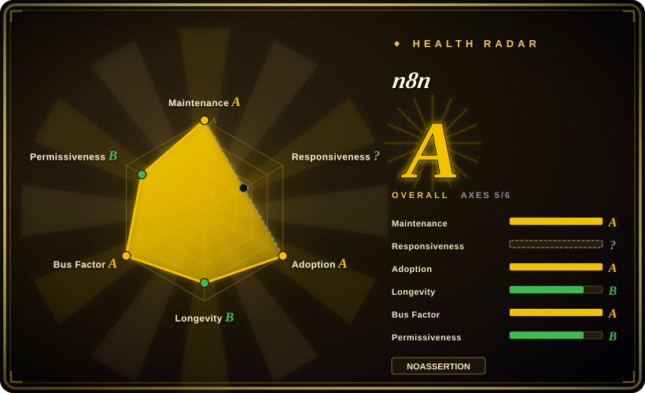

# n8n

A fair-code workflow automation platform with native AI capabilities — combine visual building with custom code, self-host or use the cloud, with 400+ integrations.

## When to use

You're a technical team that needs to automate internal processes — pulling data from APIs, transforming it, and pushing it to other systems — but you don't want to write and maintain thousands of lines of boilerplate integration code. You need a visual builder for non-engineers to contribute, but you also want the ability to drop into JavaScript or Python when the visual nodes hit their limits. You want to self-host for data sovereignty, or you need an AI-native platform that can build agent workflows with LangChain. n8n gives you both the speed of no-code and the flexibility of code.

## When NOT to use

- **If you need sub-second real-time event processing** — n8n is a batch workflow engine, not a low-latency stream processor; use Kafka/Flink or a stream-processing platform instead.
- **If you need a pure code-only CI/CD pipeline** — n8n's visual builder is its selling point; for GitOps or infrastructure-as-code pipelines, use Argo Workflows or GitHub Actions.
- **If you need a fully open-source license without restrictions** — n8n uses a "fair-code" license (Sustainable Use License) that restricts reselling and competing; not OSI-approved.
- **If your workflows are extremely simple (one or two HTTP calls)** — The overhead of running n8n (database, web server, workers) is overkill for trivial scripts; use Zapier or a simple cron job.
- **If you need enterprise-grade multi-tenant SaaS out of the box** — The self-hosted version requires significant setup; the cloud offering is managed by n8n GmbH.

## Comparison

| Alternative | In index | Our verdict | Tradeoff |
| --- | --- | --- | --- |
| [Apache Airflow](airflow.md) | ✅ | Python DAG orchestrator with a mature ecosystem. | Airflow is code-first and batch-data-pipeline focused; n8n is visual-first and integration-focused. |
| Prefect | 未收录 | Modern Python workflow orchestrator with a cleaner DX than Airflow. | Prefect is code-first; n8n adds a visual builder and 400+ pre-built integrations. |
| Zapier | 未收录 | Cloud-only, no-code automation SaaS. | Zapier requires no setup but is proprietary, cloud-only, and charges per task; n8n is self-hostable. |
| Argo Workflows | 未收录 | Kubernetes-native workflow engine. | Argo is for containerized CI/CD and ML pipelines on K8s; n8n is for API integrations. |
| Make (Integromat) | 未收录 | Visual automation SaaS with a large integration library. | Make is cloud-only and proprietary; n8n offers self-hosting and code extensibility. |

## Tech stack

- **TypeScript** — primary implementation language
- **Node.js** — runtime
- **Vue.js** — frontend editor UI
- **PostgreSQL / SQLite** — metadata database (configurable)
- **Redis** — job queue and caching (optional but recommended)

## Dependencies

- **Database** — PostgreSQL (recommended) or SQLite (lightweight)
- **Node.js** — runtime for the server
- **Redis** — for queueing and caching in production setups
- **Docker** — recommended for deployment
- **Reverse proxy** — nginx/traefik for TLS termination if exposed to the internet

## Ops difficulty

**Medium**. n8n can be started with a single `npx` command or Docker one-liner for local use, but production self-hosting requires a database, Redis, backups, and monitoring. The fair-code license also means you must understand the usage restrictions before commercial deployment.

## Health & viability

- **Maintenance**: Very active — pushed daily, 195k stars, 1,435 open issues, regular releases.
- **Governance**: Owned by n8n GmbH, a commercial entity with a clear roadmap. The project is both open-source and commercially backed.
- **Backing**: n8n GmbH is a venture-backed company with a sustainable business model (cloud offering + enterprise support).
- **Adoption**: 195k stars, 400+ integrations, 900+ workflow templates, and a large community forum. Strong ecosystem.
- **Longevity**: Created in 2019, so ~7 years old with continuous activity. Good Lindy signal.
- **Risk flags**: The fair-code license (Sustainable Use License) is not OSI-approved and restricts competing use. This is a deliberate open-core strategy. Enterprise features (SSO, air-gapped) are gated behind paid tiers.

## Caveats (unverified)

- [未验证] The exact fair-code license terms may have evolved; verify the current Sustainable Use License text before commercial deployment.
- [未验证] The "400+ integrations" number includes community and official nodes; quality and maintenance level vary.
- [推断] The n8n GmbH cloud offering's pricing and feature gates may change over time as the company pursues revenue growth.
