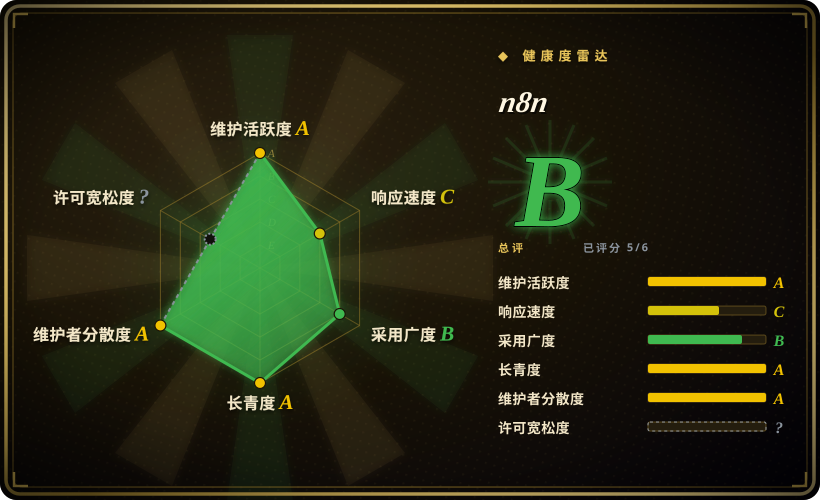

# n8n

一款 fair-code 工作流自动化平台，原生支持 AI 能力——结合可视化搭建与自定义 JavaScript/Python 代码，可自托管或上云，内置 400 余种集成和 900 余个即用模板。

## 何时使用

你是一支技术团队，需要自动化内部流程——从 API 拉取数据、转换后推送到其他系统——但不愿写并维护成千上万行集成样板代码。你需要一个可视化构建器让非工程师也能参与，同时也希望在可视化节点遇到限制时能下沉到 JavaScript 或 Python。你想自托管以保障数据主权，或需要一个原生支持 AI、能用 LangChain 构建智能体工作流的平台。选择 n8n 而不是 Zapier，因为 n8n 可自托管且支持代码扩展；选择 n8n 而不是 Apache Airflow，因为 n8n 以可视化优先，自带 400 余个预置集成，无需从零写 Python DAG。决定取舍：无代码原型的速度，加上真实代码的逃生舱。

## 何时不用

- 如果你需要亚秒级实时事件处理，请用 Kafka 或 Flink 而不用 n8n，因为 n8n 是批处理工作流引擎，不是低延迟流处理器。
- 如果你需要纯代码的 CI/CD 流水线，请用 Argo Workflows 或 GitHub Actions 而不用 n8n，因为 n8n 的可视化构建器是其卖点，对基础设施即代码流水线反而增加开销。
- 如果你需要完全无限制的 OSI 批准开源许可，请用 Apache Airflow 或 Prefect 而不用 n8n，因为 n8n 使用“fair-code”Sustainable Use License，限制转售与竞争。
- 如果你的工作流极其简单（一两次 HTTP 调用），请用 Zapier 或简单 cron 而不用 n8n，因为运行 n8n 的开销（数据库、Web 服务器、worker）对 trivial 脚本来说过重。
- 如果你需要开箱即用的企业级多租户 SaaS，请用 Zapier 或 Make 而不用 n8n，因为自托管版需要大量配置，云端版本由 n8n GmbH 托管。

## 横向对比

| 替代品 | 是否收录 | 我们的评价 | 取舍 |
| --- | --- | --- | --- |
| [Apache Airflow](airflow.zh.md) | ✅ | 拥有成熟生态的 Python DAG 编排器。 | Airflow 是代码优先、面向批处理数据管线；n8n 是可视化优先、面向集成，自带 400 余个预置节点。 |
| Prefect | 未收录 | 比 Airflow 更现代的 Python 工作流编排器，开发者体验更简洁。 | Prefect 是代码优先；n8n 额外提供可视化构建器和 400 余个预置集成。 |
| Zapier | 未收录 | 纯云端无代码自动化 SaaS。 | Zapier 无需配置，但专有、仅限云端、按任务计费；n8n 可自托管且支持代码扩展。 |
| Argo Workflows | 未收录 | Kubernetes 原生工作流引擎。 | Argo 面向 K8s 上的容器化 CI/CD 与 ML 流水线；n8n 面向 API 集成与业务自动化。 |
| Make（Integromat） | 未收录 | 拥有大量集成库的可视化自动化 SaaS。 | Make 仅限云端且专有；n8n 提供自托管与代码扩展能力。 |

## 技术栈

- **TypeScript**——主要实现语言
- **Node.js**——运行时
- **Vue.js**——前端编辑器 UI
- **PostgreSQL / SQLite**——元数据库（可配置）
- **Redis**——作业队列与缓存（可选但推荐）

## 依赖

- **数据库**——PostgreSQL（推荐）或 SQLite（轻量）
- **Node.js**——服务器运行时
- **Redis**——生产环境中的队列与缓存
- **Docker**——推荐用于部署
- **反向代理**——如暴露到互联网，需 nginx 或 traefik 做 TLS 终结

## 运维难度

**中等**。n8n 可用单条 `npx` 命令或 Docker 一行命令本地启动，但生产级自托管需要数据库、Redis、备份和监控。fair-code 许可也意味着在商业部署前必须理解使用限制。

## 健康度与可持续性
- **维护活跃度**：Grade A——最近 13 周中 13 周有提交；最后提交距今 0 天。
- **响应速度**：无法计算——评分器没有找到可用于计分的近期 issue/PR 互动样本（`no_traffic`）。
- **采用广度**：Grade B——npmjs.org 上月下载量 1,313,694（包名：n8n-workflow）。
- **长青度**：Grade A——仓库已创建 2567 天。
- **治理集中度**：Grade A——前三贡献者占比 14.9%。
- **许可风险**：无法计算——fair-code 许可未被解析成可比较的 SPDX 风格档位（`license_unparsed`）。

## 存疑（未验证）

- [未验证] fair-code 许可的具体条款可能已发生变化；商业部署前请核实当前 Sustainable Use License 文本。
- [未验证] “400 余种集成”包含社区与官方节点；质量与维护水平参差不齐。
- [推断] n8n GmbH 云服务的定价与功能门槛可能随公司追求收入增长而调整。
